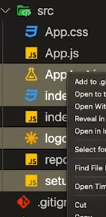

# SockJs

https://www.youtube.com/watch?v=djMy4QsPWiI&list=RDCMUC8S4rDRZn6Z_StJ-hh7ph8g&start_radio=1&rv=djMy4QsPWiI&t=313

# server

- [(nodeJS) express, nodemon, socket.io 설치하기 :: 아는 만큼 보인다 (tistory.com)](https://livedata.tistory.com/60)
- `node index.js` server running (node 파일명)

```json
{
	"scripts":{
		"start":  "nodemon index.js"
	},
//추가하고 npm start로 서버 실행
```

 remove

# client

```bash
npm add socket.io-client
//use socket io in react
```


# 다른 영상

https://www.youtube.com/watch?v=oxFr7we3LC8

```bash
$ npm init -y

//realtime data connection
$ npm install cors express nodemon socket.io 

//server
nodemon index.js

//frontend
npx create-react-app ./client
//밖에서 설치
npm install  react-copy-to-clipboard simple-peer socket.io-client

mui는 client안에서 설치 @material-ui/core @material-ui/icons
```

```bash
create empty index.js file
```

