# WEB 3

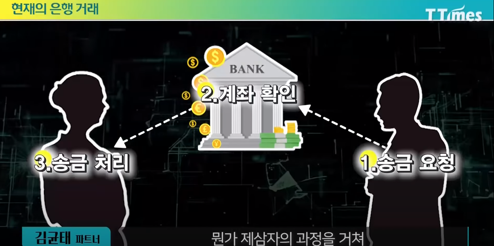

- 블록체인은 암호학과 결합
  - 내가가진 디지털 자산은 프라이빗 키에 맵핑되어 있음.
  - 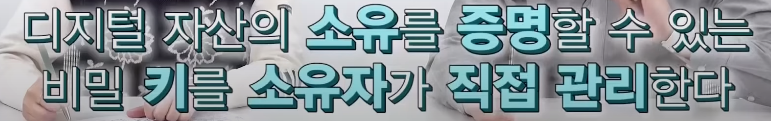 
  - 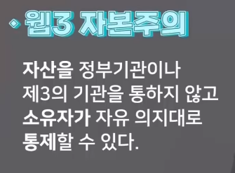 
  - 유저에게 권한을 돌려준 것 === 자본주의에 대한 취지

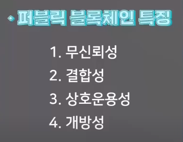 

## DAO

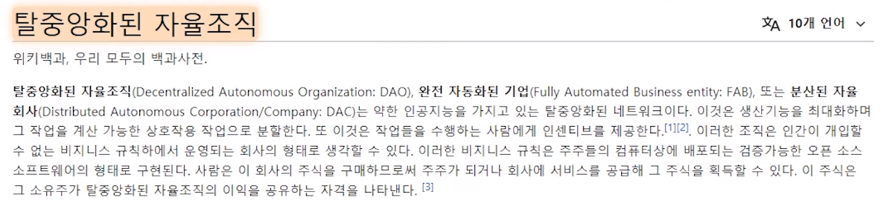 

- 서로 약속된 프로토콜을 따르는가

## 웹3 사용이유

- 탈 중앙화

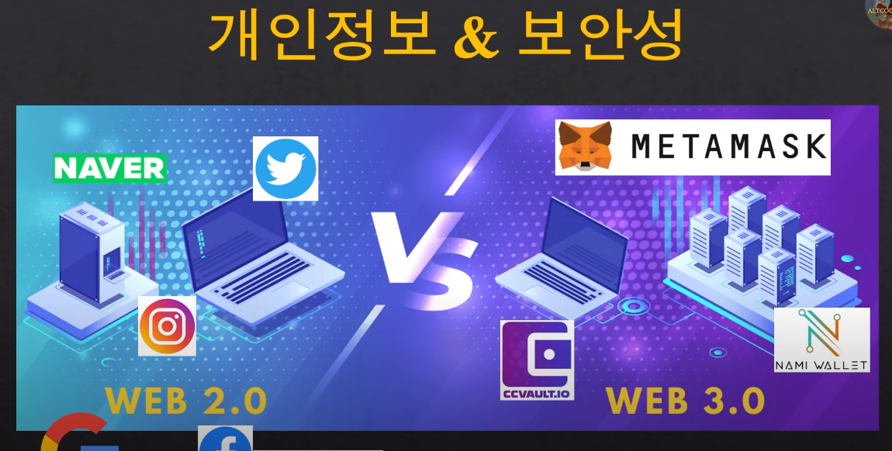

* 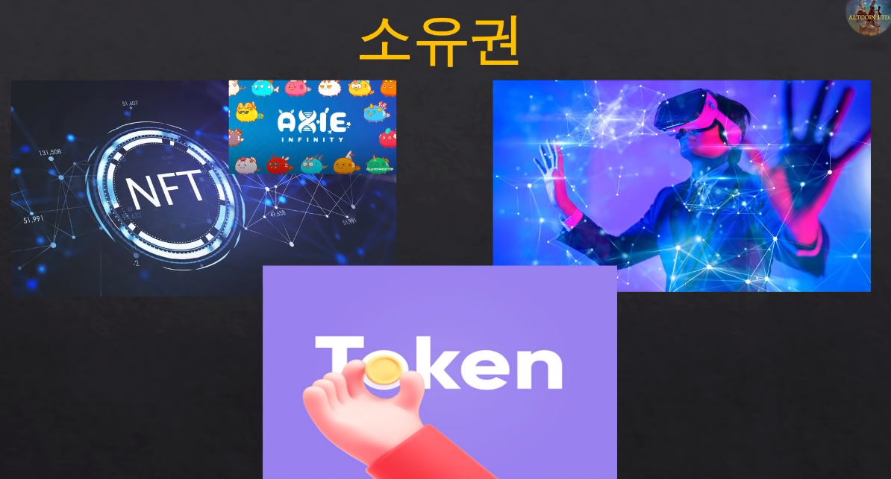

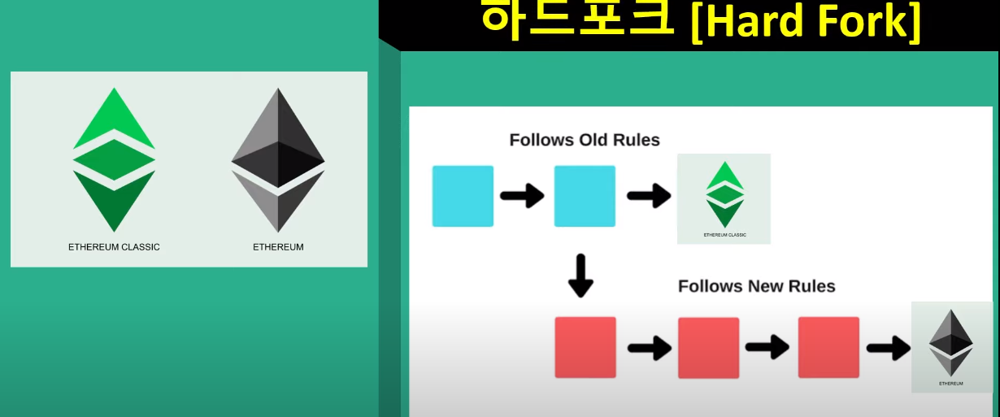 

## NFT

- 크립토 펑크
  - 알티팩트(디지털 스니커즈)
  
- 아트, 스포츠, 게임, 게임을 포함한 모든 디지털 플랫폼

- **2차 창작물의 콘텐츠 시장**
  - 디즈니가 가지는 IP비즈니스
  - 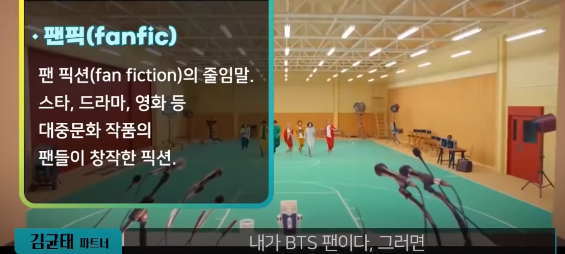 
  - 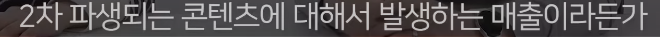 
  - 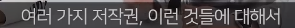 
  - 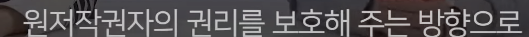 
  - 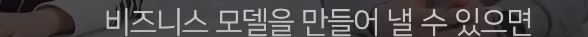 
  - 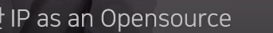 
  - `디지털 콘텐츠, ip의 오픈소스`
  - 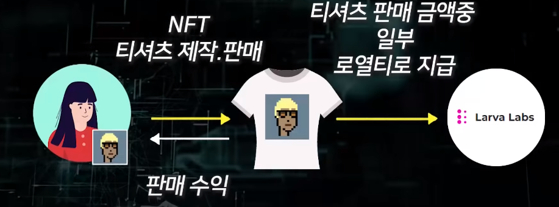 
  - 컬렉터블 NFT
  - 콜라보(유저경험) - 다른 게임, 다른 메타버스 안에서 내 캐릭터를 쓸 수 있는 경험
    - 위쳐, 몬스터헌터
    - 더 소유하고 싶은 NFT
  - 어떤 커뮤니티, 사용자 경험을 느끼는지를 소유
  - 그림을 그려서 만화책을 만들 수 있도록
  - 엑시
  - 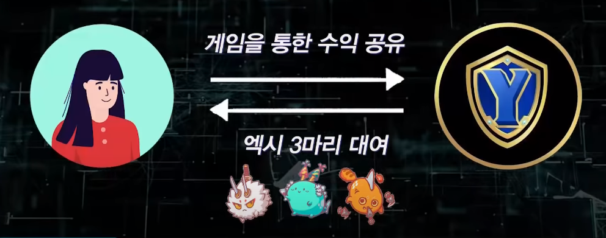
  -   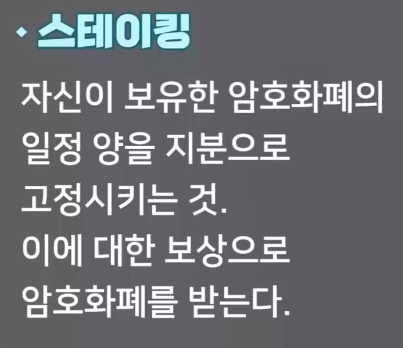 
  
  

---

참고

- [웹3티타임즈](# https://www.youtube.com/watch?v=vtLTOA75Y-w)

- [웹1,2,3 비교](# https://www.youtube.com/watch?v=hV0u36sIBPI)
- https://www.youtube.com/watch?v=9lryfa1_kA0