# 블록체인 분류


## 유형

### 퍼블릭

- 누구나 네트워크에 참여
  - 비트코인, 이더리움

### 프라이빗

- pc에서 구동 -> 테스트용이나 실습용으로 사용
- 하나의 조직 기관이 관장하는 네트워크로, 승인된 주체만 자료읽고, 지정노드만 거래 승인
  - 쿼럼, 멀티체인

### 컨소시엄

- 이해관계자 간에 컨소시엄을 구성하여 네트워크를 구성, 네트워크 참여자에 의해 접근 허용


## 1. 퍼블릭 네트워크

### 이더리움 네트워크

- 개념도

  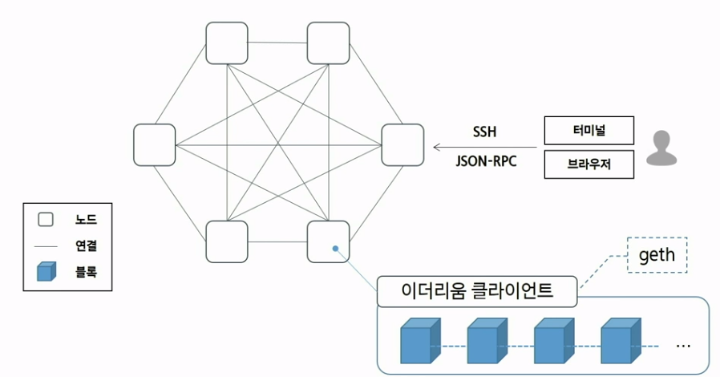 

  - 이더리움 클라이언트로, 어떤 네트워크에 참여할지 정할 수 있음
    - geth라는 클라이언트를 주로 사용


- 메인넷
- 테스트넷
  - 롭슨, 코반, 링키비, 고얼리


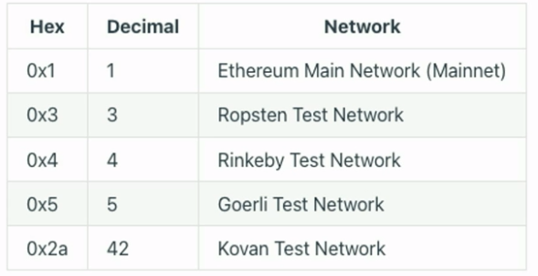 

[Clients - ethernodes.org - The Ethereum Network & Node Explorer](https://ethernodes.org/)

 


#### Metamask 설치

- https://metamask.io/download/

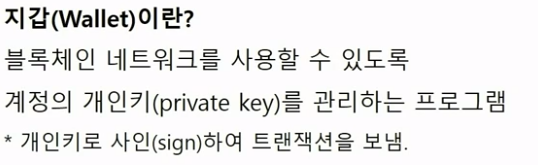 

- 계정 생성 절차

  - 개인키 생성(64자리의 Hex값으로 인코딩 0~10^70 사이에서 랜덤)

    -> 타원곡선전자서명 알고리즘 -> 공개키 생성

    -> 공개키를 keccak-256 hashing(0x + 마지막 20byte) -> 계정주소


- Ropsten에서 사용할 이더

  - Faucet(수도꼭지)

    - 테스트넷 환경을 사용할 수 있도록 가치없는 통화를 무료로 제공하는 자금원

    - rETH '  ROP로 표기
    - [ropsten faucet검색][ https://faucet.egorfine.com/   에 복붙 !
    - 무료 이더로 계정 추가해서 보내보기 연습

- MetaMask Provider API 활용 실습

  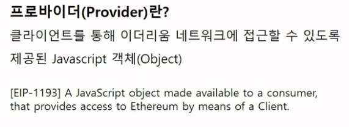 

  - EIP(이더리움 표준)에 정의

  - [metamask provider] 검색

  - **Ethereum Provider API**

    - https://docs.metamask.io/guide/ethereum-provider.html   공식문서
    - 크롬 - 개발자도구 콘솔

  - 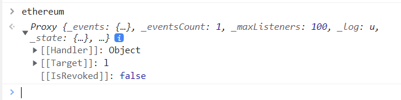 

  - 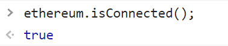 

  - 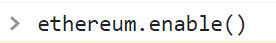 

  -  

  - **Etherium Provider로 RPC API보내기(Remote Procedure Call)**

    - RPC: 별도의 원격제어를 위한 코딩 없이, 다른 주소공간에서 함수나 프로시저를 실행할 수 있게하는 프로세스 간 통신기술 (원격 프로시저 호출)

    - 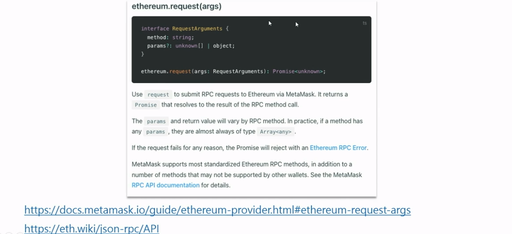 

    - 이더리움 내 현재 블록이 몇개 쌓였는지 ? 

    - 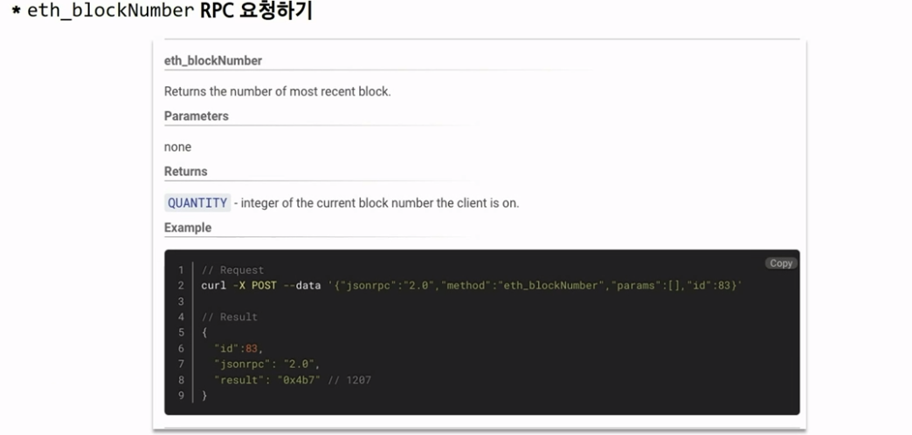

    - 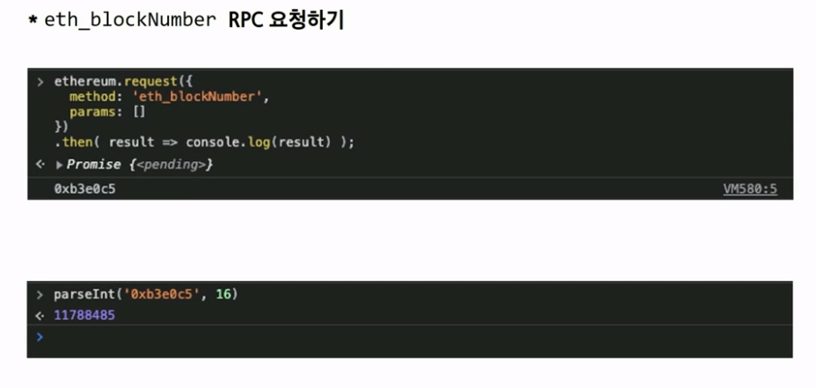
    
    - ```js
      ethereum.request({
          method: 'eth_blockNumber',
          params: []
      }).then(result => console.log(result));
      
      parseInt('결과')
      => ㅇㅇㅇ개의 블록
      ```
    
      
    

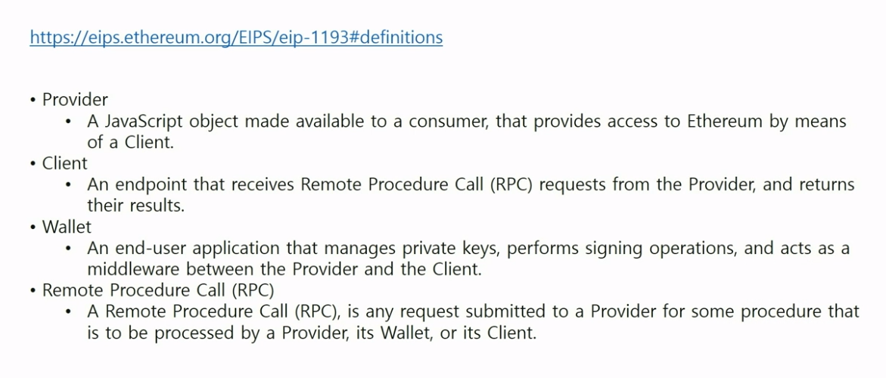


