[TOC]

# Smart Contract

## 1. smart contract란?

- `contract: 계약`

- 디지털 형식으로 명시된 서약들의 집합(계약 내역이 담겨있음)

- 단순 컴퓨터 프로그램, 법적 맥락 없음

- 블록체인에서 정의: 불변의 컴퓨터 프로그램 *마스터링 이더리움

  - 한번 배포시 변경 불가
  - 결정적 실행한 결과가 같음
  - EVM위에서 동작(ethreum vertual machine)
  - 탈중앙화된 world computer 동일한 상태를 유지

- smart contract(계약)를 작성하는 언어

  - 확장성이 높은 언어를 사용하지 않기 위함
  - solidity
  - LLL
  - Viper
  - Assembly

- 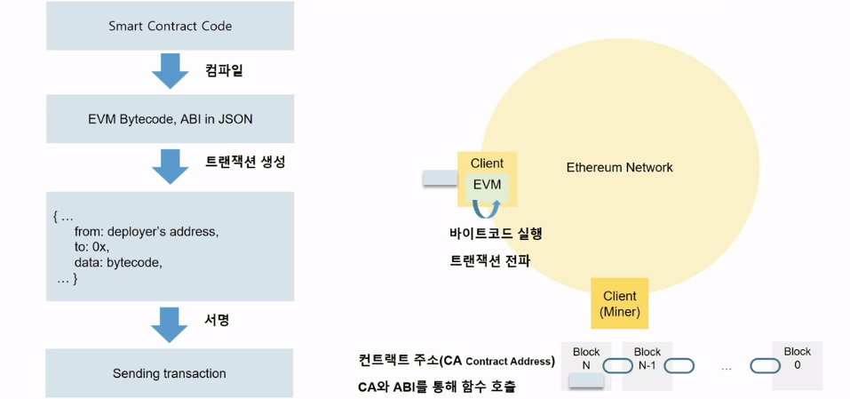 

- 바이트코드를 담아서, 서명-> 블록체인 네트워크로 전송-> 다른 컨트랙트 호출

- 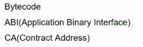 정의 찾아보기

  

## 2. 실습환경 준비

### Remix IDE

https://remix.ethereum.org/#optimize=false&runs=200&evmVersion=null&version=soljson-v0.8.7+commit.e28d00a7.js

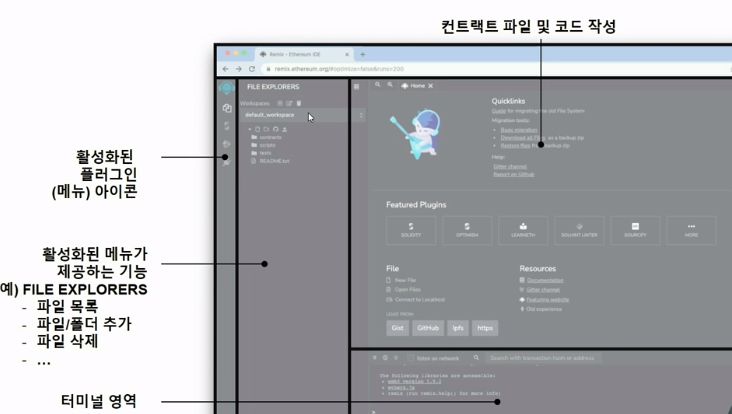 

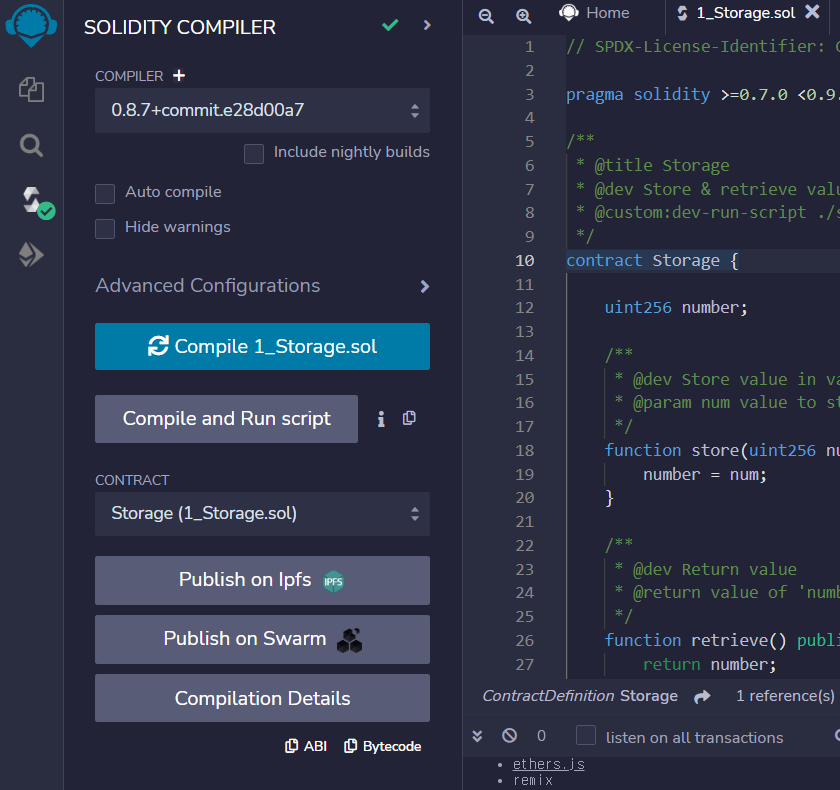 

컴파일 후, ABI Bytecode 생성

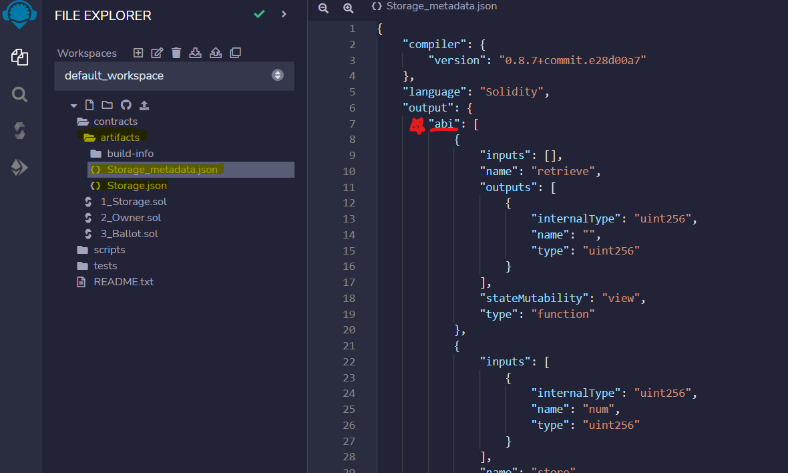 

어떤 함수를, 어떤 파라미터로, 어떤 output, return 값으로.....등등 정의되어 있는지 확인할 수 있음

## 3. smart contract 배포

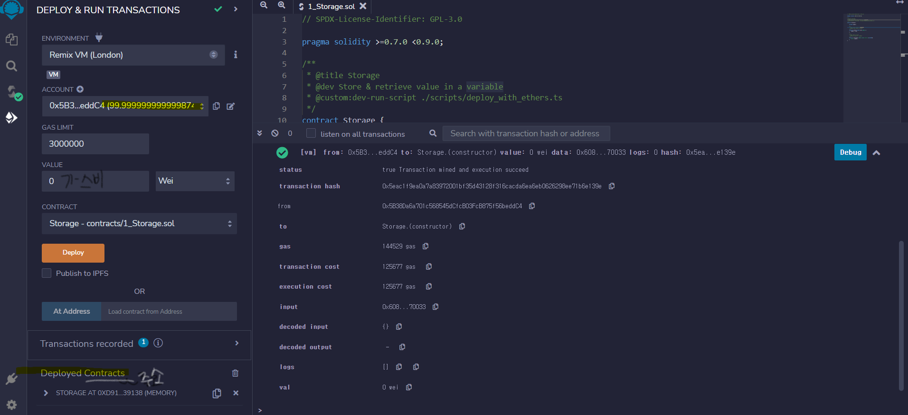 

deploy 버튼 클릭으로 트랜잭션 생성 후 브라우저 기반 가상환경 JS VM에서 즉각 처리

```js
0xd9145CCE52D386f254917e481eB44e9943F39138
배포된 컨트랙트 주소
```


## 4. smart contract 호출

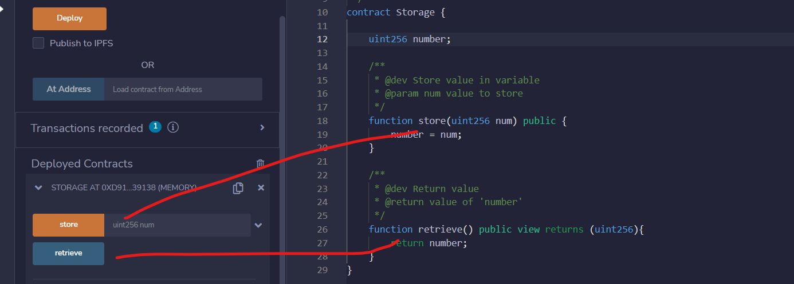 

### 1. retreive 

- get의 형태
- 가스를 쓰진 않음(저장된 값을 불러오는 것)
- 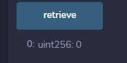 

### 2. store

- 파라미터에 number를 설정해서 넘겨줌(num)
- 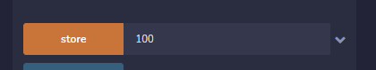 

- 가스 사용 확인 하기
- retrive확인 - 반환값이 100으로 변경됨을 확인
- 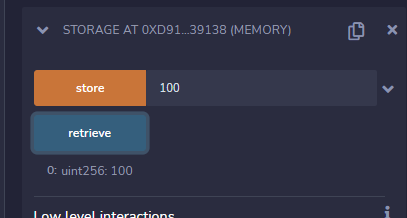 
-  num란 ?
  - 이더리움 네트워크에서 실행하면, 모든사람의 이 주소의 num에는 100 이 저장되어 있는 것이며 
  - 해커가 이 contract를 호출하지 않는 이상 값을 바꿀 수 없다. (불변의 데이터)
  - 스마트 컨트랙트의 기본 원리


#### 내가 사용자 일때, 값 100 확인

- 복사한 CA(contract address) 붙여넣기 > At address 버튼 클릭 ->결과 확인

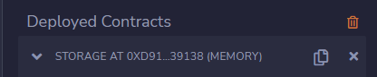 

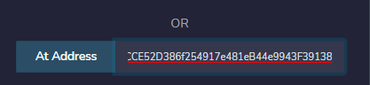 

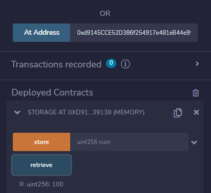 


## 과제

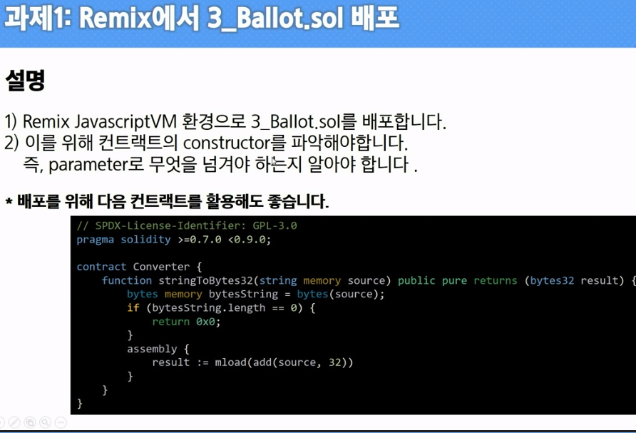 

- constructor 로 넘기는 parameter에 type을 맞춰줘야함

 

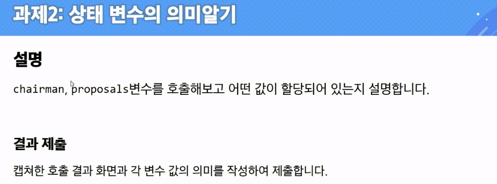 


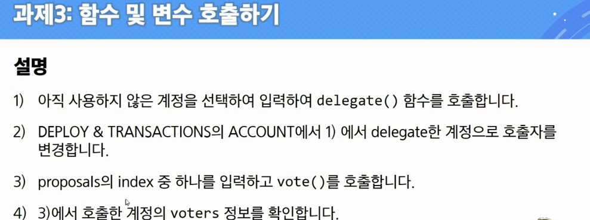 

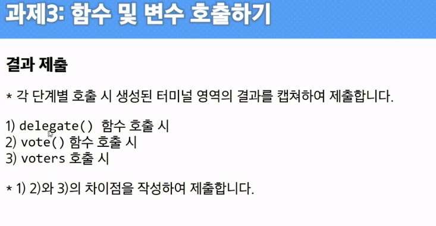 


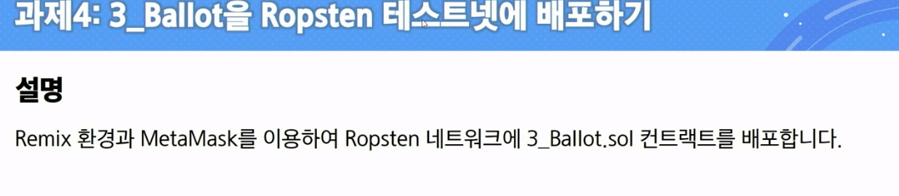 

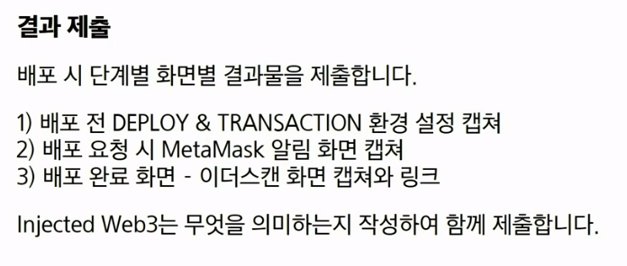 


