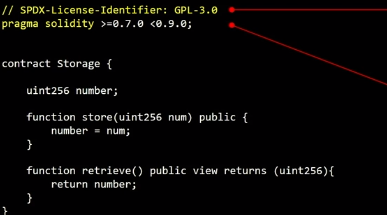
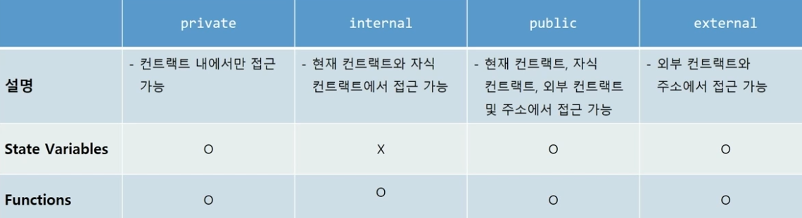
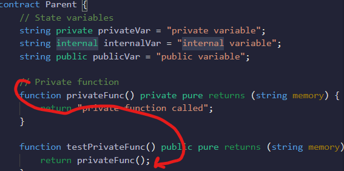
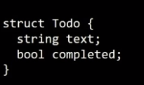
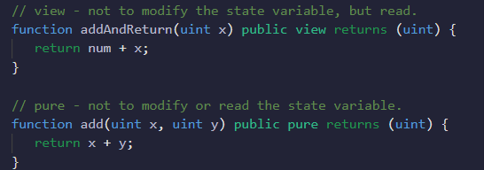
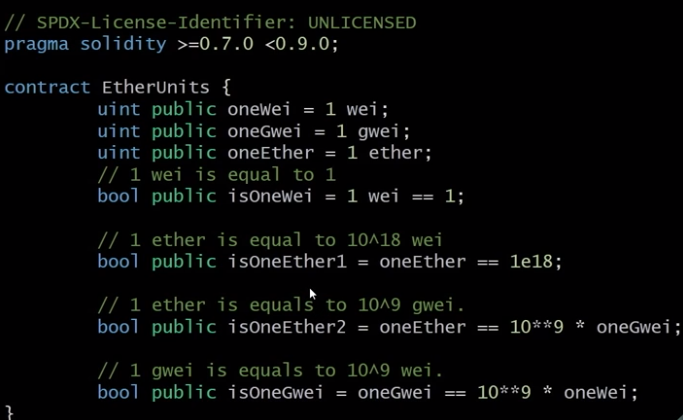
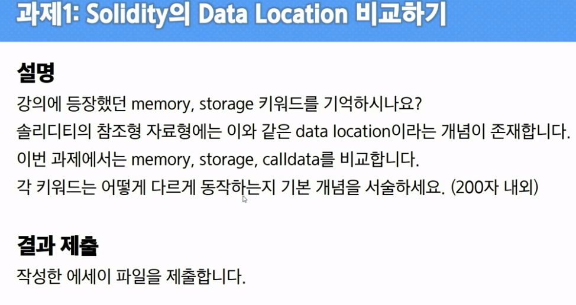
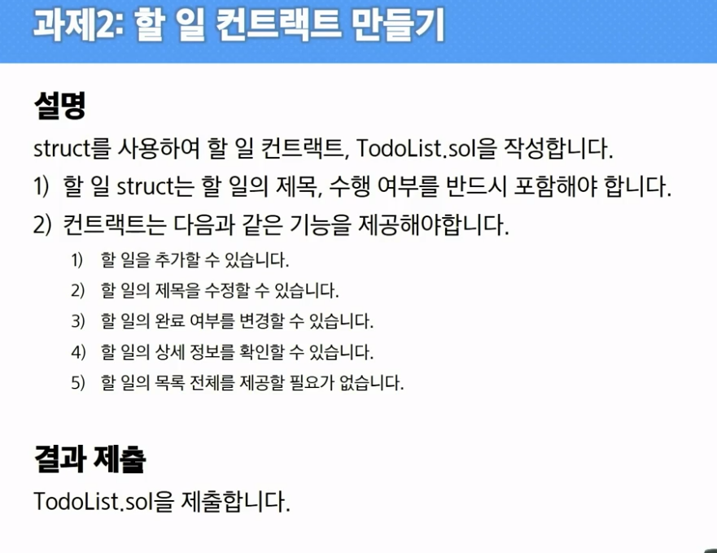
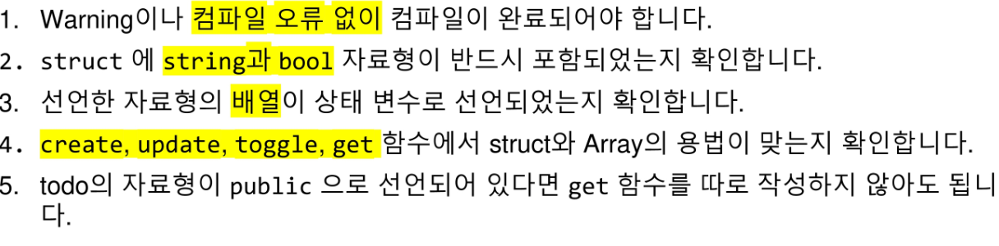

# Solidity 기본 문법

## 1. 솔리디티 컨트랙트 기본 구조

 

- 위) 소스코드의 라이선스를 GPL-3.0으로 명시

- 아래) version pragma: 소스코드가 이용하는 컴파일러 버전 명시

  - sematic versioning을 따름. major. minor. patch

  - ^(캐럿 연산자): '이상'

- contract Storage (변수에 해당하는 부분)
  - **상태변수(contract의 최상위단에 선언된 변수들)**
    - 어떤 함수의 속한 변수가 아니라 컨트랙트에 속한 변수의 의미함
    - unit256 number;
  - 상태변수의 접근 제어자 지정 가능
    - external, public, private
  - 기본형, 구조체, 배열 등 다양한 자료형
- function
  - 컨트랙트 단위 기능
  - 매개변수, 제어자, 반환값 지정 가능
  - 함수 내부에서 상태변수의 값을 변경하고, 읽을 수 있음

## 2. 예제로 기본 문법 익히기

### 자료형

**기본형**

1. 논리형: bool

2. 정수형: (8~256nit을 표현 가능, uint == uint256)

   unit: unsigned integer(양의 정수)
   int: signed integer

3. 주소형: address: 이더리움의 주소를 표현
4. 바이트형: bytes# or byte[]: 데이터를 바이트로 표현할 수 있음

###  접근제어자

- 상태변수나, function에 들어갈 키워드

 

 

private에 직접 접근할 수 없어서 testprivatefunc라는 public함수에서 호출 할 수 있음.

**external**같은 경우엔, 외부에서만 호출 가능한 함수

### 자주 쓰는 자료형

**배열**

**:star: 매핑**

- 접근, 추가, 삭제 등
- key의 목록을 얻을 수 있는 방법을 제공하진 않음(keylist는 별도의  array를 통해 가지고 있어야 접근 가능)

### 사용자 선언형

**struct**

- 여러 자료형을 하나의 관점으로 묶어서 관리하고자 할 때 선언
-  
- 구조체의 array, mapping의 값으로 지정 가능

### 함수

- 선언 방법
  - 매개변수 유무, 반환값 유무
  - view, pure함수의 특징
  -  
  - view: 가스가 없어도 호출 할 수 있음을 명시
    - 경제적으로 프로그래밍하게 함
  - pure: 상태변수(x, y)에 접근하지 않아도, 값을 실행할 수 있음
    순수한 함수이다.
- 2개 이상의 값을 반환하도록 선언하는 방법

### 제어문

**if-Else**

**for/ while**

- 루프문은 큰 리스크를 안고 있었지만, 이더리움이 튜링 완전머신이라고 할 수 있는 이유는?

- **gas라는 개념의 도입 덕분**

  - 무한루프라면, gas가 계속 차감될 거임.

  - 어떤 함수이던지 gas limit이라는 값이 있음, 이는 특정 가스 이상은 쓸 수 없도록 함

  - 따라서, 자동으로 함수를 취소할수 있게 되면서 이더리움이 smart contract에서 루프를 사용할 수 있게됨

  - 하지만 <u>탈출조건, 무한루프 탈출</u>을 위한 로직을 고려하여 작성

    

### :star: 화폐 단위(주의)

**test한 후 mainnet에 올리기**

evm에서 소수점을 허용하지 않음

 

- **ether**
  - 1ether == 10^18 wei (1e18)
- **wei**
- **gwei**
  - gwei = 10^9 wei

## 3. 과제

 

 

 