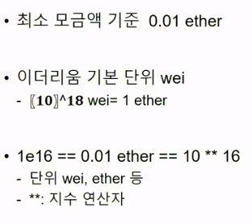
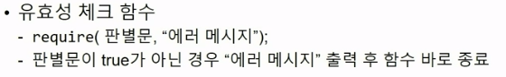
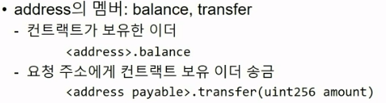

# FundRasing 구현하기

## 1. FundRasing 시작하기

- 모금을 통한 기부 프로세스

- 실제로 기부가 잘 됐을까? 하는 정보의 불투명성 해결\

- remix IDE

- 기능

  - 일회성으로 동작하는 모금 컨트랙트

  - 일정기간동안 이더 지불해 모금에 참여

    - 모금
    - 현재 모금액 확인
    - 모금액 수령기능

  -  

    

## 2. fund()

- 모금
- payable 함수 (이더를 받을 수 있는 함수)
- msg.value: 트랜잭션에 얼마를 보냈는지 알 수 있는 전역 변수
- require: 유효성 체크 함수
  
-  
-  
-  
- 

## 3. currentCollection()

## 4. withdraw()

 