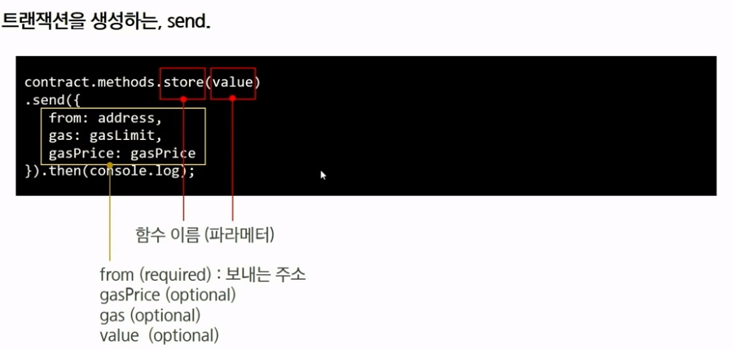

# Dapp

## 1. Dapp - decentralized application

- 탈중앙화된 P2P네트워크 상에 백엔드 로직이 구동되는 응용프로그램
  - 블록체인 상의 스마트 컨트랙트가 기존의 중앙화된 서버에 의해 서비스를 제공하는 시스템 대체
- 좀 더 좁은 의미에서 Dapp은 사용자 인터페이스를 통해 블록체인의 스마트 컨트랙트를 호출함으로써 동작하는 응용 프로그램
- Dapp = frontend + smartcontract on blockchain
  모바일이나 웹 화면에서 smartcontract function을 호출하는 웹 프로그램이다.

## 2. 구성요소

1. 스마트 컨트랙트

   - 서비스 로직이 구현된 이더리움 네트워크에 배포된 바이트코드

2. 사용자 인터페이스

   - dapp의 사용자 인터페이스

   - 주로 html, css, js 등 프론트엔드 기술로 구현

3. web3 api for JS

   - 이더리움 스마트 컨트랙트와 JS코드간의 상호작용 지원

## 3. web3.js

이더리움 네트워크와 상호작용할 수 있게하는 JS 라이브러리 모음

 

- 이더리움 네트워크가 존재, 여기서 구동하는 EVM이 각 노드마다 설치되있음
  == 스마트컨트랙트 배포되있음

- web3.js: 누구도 소유하지 않는 데이터에 접근

  

  

## 4. dapp 구현

1.  

2.   

3. 디플로이

4. html 파일에 cdn추가

   ```html
   <script src="https://cdn.jsdelivr.net/gh/ethereum/web3.js@1.0.0-beta.34/dist/web3.min.js"></script>
   ```

   https://cdn.jsdelivr.net/gh/ethereum/web3.js@1.0.0-beta.34/dist/

   web3.min.js 참고

   - 별도의 JS파일 생성 

5.  

6. 

    

7. retrive호출

   - view <- call

    

    

8. store호출

   - 일반적으로 컨트랙트 수정하는 함수 <- send

     

   - value; 보낼 이더리움 개수

    

   

## 5. 과제

 

 

html, js 제출
