[TOC]

# 환경설정

- [chocolatey설치]

1. powershell관리자권한 실행

   - [사이트에서 복붙](# https://chocolatey.org/install)

   ```bash
   Set-ExecutionPolicy Bypass -Scope Process -Force; [System.Net.ServicePointManager]::SecurityProtocol = [System.Net.ServicePointManager]::SecurityProtocol -bor 3072; iex ((New-Object System.Net.WebClient).DownloadString('https://community.chocolatey.org/install.ps1'))
   ```

   ```basg
   choco install git -y
   choco install golang -y
   choco install mingw -y
   ```

2. cmd

   ```bash
   mkdir src\github.com\ethereum
   git clone https://github.com/ethereum/go-ethereum --branch v1.9.24 src\github.com\ethereum/go-ethereum
   cd src\github.com\ethereum\go-ethereum
   go get -u -v golang.org/x/net/context
   go install -v ./cmd/...
   geth version
   ```

3. powershell관리자권한 실행(but cmd 관리자실행에서 됨)

   - node.js

   ```bash
   choco install nodejs-lts
   ```

4. commend 창

   - ganache-cli 설치

   ```bash
   npm install -g ganache-cli
   ```

   - 설치확인

   ```bash
   ganache-cli --version
   ```

- 이더리움 계정 관련 이론
  - 개인키(로컬pc) -> 공개키 생성 -> hash -> 계정주소 볼 수 있음!

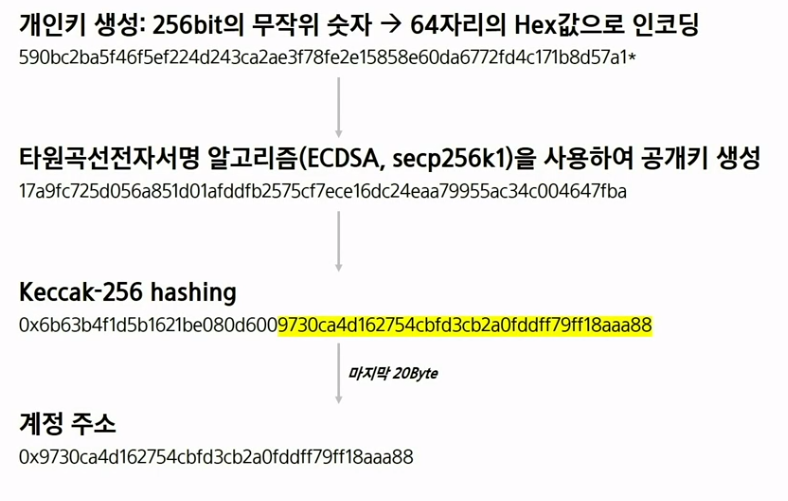 

- 지갑 생성 관련 이론
  - 디지털 서명시 - 개인키로 서명
  - 복구 - 공개키로 복구
  - 개인키로 암호화한 해쉬값 === 공개키로 암호화한 해쉬값이 같으면,
    내가 서명한것으로 이해

 

## 로컬 네트워크 활용 및 실습: 가나슈 구동

- 가나슈
  - dapp을 만들때, 마치 내 pc가 이더리움 네트워크인것처럼 구동

- 로컬 테스트넷 구동

  ```bash
  cd src\github.com\ethereum\go-ethereum
  ganache-cli -d -m -p 7545 -a 5
  ```

  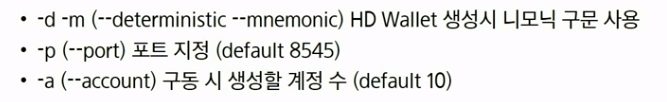 

- 명령어 옵션 확인

  ```bash
  ganache-cli --help
  ```

  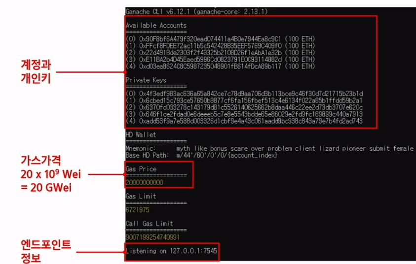 

  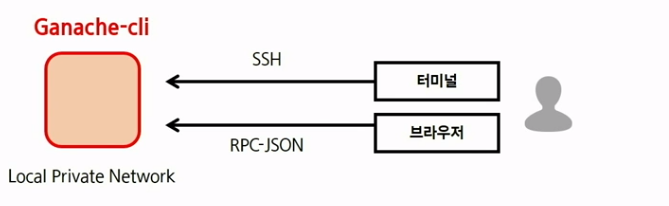 

  

## 1. Geth

## 2. Ganache

## 3. Wallet


- geth를 구동하겠다 === 가나슈 네트워크에 접속하겠다

- new cmd

  ```bash
  cd src\github.com\ethereum\go-ethereum
  geth attach http://localhost:7545
  ```

- 연결성 확인

  ```bash
  net.listening
  net.peerCount
  ```

- 계정 목록 확인

  ```bash
  eth.accounts
  ```

- 계정 보유 잔액 확인

  - getBalance = 한 지갑의 이더 보유량

  ```bash
  web3.fromWei(eth.getBalance(eth.accounts[0]))
  ```

### 로컬과 연결하는 방법

	- 브라우저로 ganache-cli연결

- RPC URL

  http://localhost:7545

- 체인 ID

  geth console에서 chainID 확인

  ```bash
  eth.chainId()
  "0x539"
  ```

- 메타마스크

  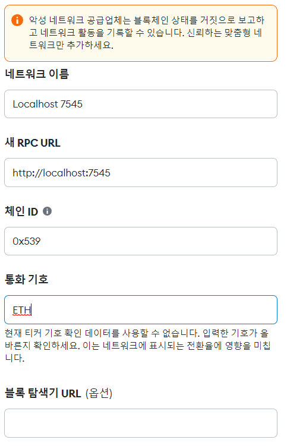 

- eth +enter ?명령어

- geth console로 진행

  ```bash
  eth.accounts
  tx = {from: :"가나슈 제공 계정 중 하나", to: "메타마스크 계정", value: 1e18}
  eth.sendTransaction(tx)
  #transaction hash returned
  #가나슈 창 확인시, eth_blockNumber
  ```

- 로컬 네트워크 활용 및 실습: 트랜잭션 상태 확인

- geth console

  ```bash
  eth.getTransaction(transactionHash)
  eth.getTransactionReceipt(transactionHash)
  eth.getBalance(eth.accounts[0])
  # 98.9 이더 존재
  # wei를 이더로 보여주세요
  web3.fromWei(eth.getBalance(eth.accounts[0]), "ether")
  ```

- web3와 관련 확인할것
  - https://github.com/ethereum/web3.js/blob/0.20.7/DOCUMENTATION.md

## 과제

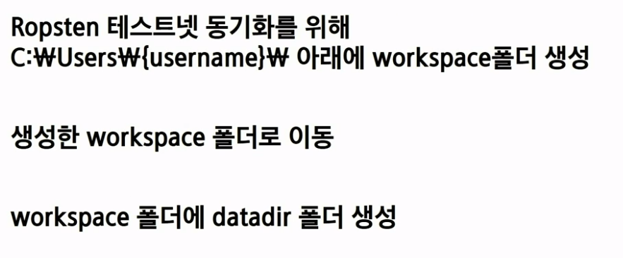 

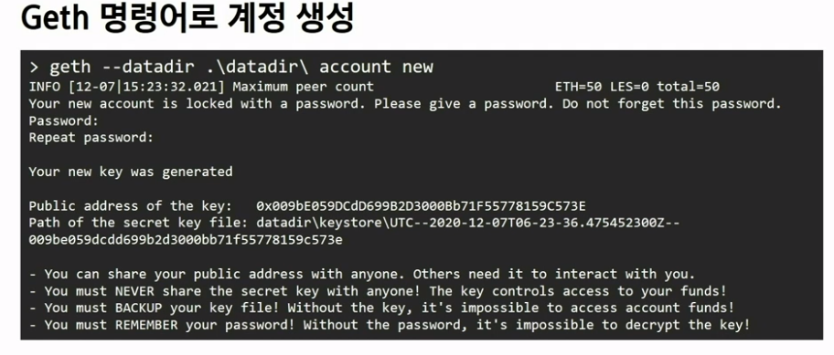 

- ropsten faucet에서 이더 받기

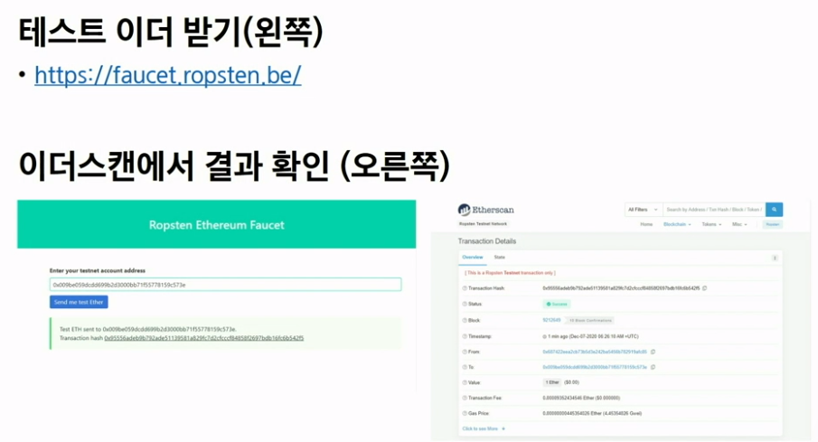 

- 동기화를 위한 포트 허용

 

- 노드 구동하기
  - geth를 통해 노드 구동

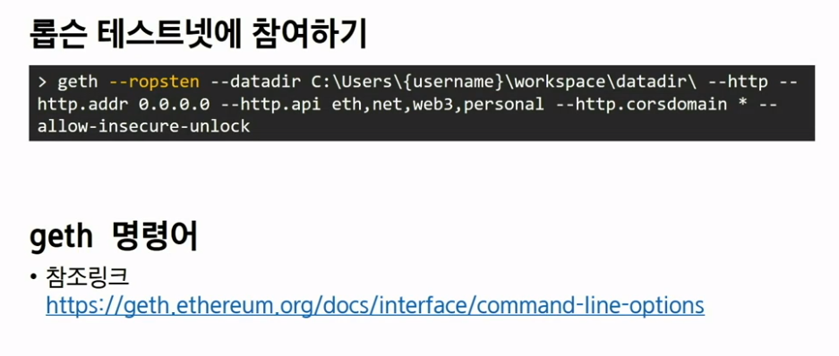

- 동기화 상태 확인

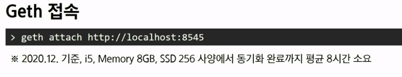 

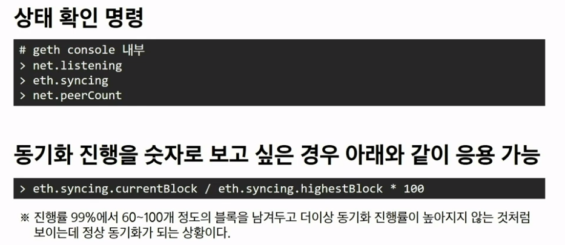 

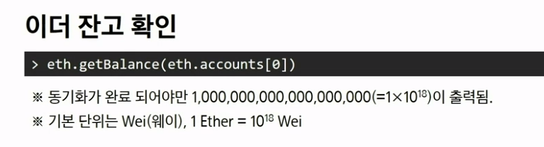 

- 동기화 완료됨