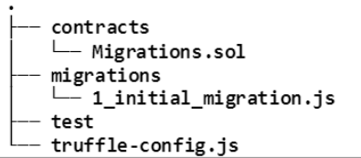
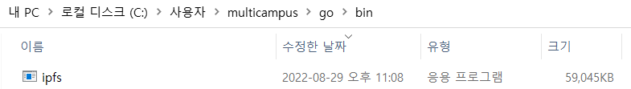
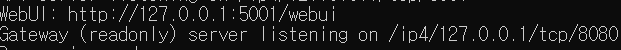
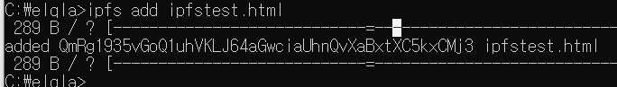

[TOC]

**NFT: 동일한 가치로 교환되지 않는 토큰**

- 크립토키티 게임
- DApp: 분산앱
- axie infinity: p2e
- 블록체인: 비트코인 등 암호화폐를 통해 디지털 데이터가 해커의 위변조를 원천적으로 봉쇄할 수 있다. 따라서 디지털 데이터 가치부여 가능해짐
  ERC-721을 따름


```
front-react
back-node.js
smartcontract-solidity+truffle
```


**SubPjt1**. nft토큰 표준 이해, 스마트 컨트랙트 작성
			  solodity문법 이해, 컨트랙트 작성, 테스트코드를 통한 동작확인

**SubPjt2**. Dapp의 형태로 플랫폼 구현, 
			사용자가 웹 화면을 통해 스마트 컨트랙트 호출하여 자신이 소유한 작품 NFT화
			Subpjt1의 스마트 컨트랙트를 이더리움 네트워크에 배포
			IPFS에 디지털 작품의 원본과 메타데이터 업로드
			스마트 컨트랙트 호출-> 작품 토큰화, NFT데이터 백엔드에 저장

**SubPjt3**. SubPjt2의 작품에 판매기능 추가, 판매를 위한 스마트 컨트랙트 추가
			  프엔-스마트컨트랙트 직접 호출 -> 거래에 참여. 스마트 컨트랙트 상태 변경시 판매결과 데이터를 백엔드에 업데이트


1) NFT 스마트 컨트랙트 구현 및 테스트
   1) ERC-721구현
   2) NFT creator 구현
   3) 테스트코드 작성

## todo

- 솔리디티 익히기

  - 상태변수자료형, 상속관계 및 컨트랙트 호출방법

  - IDE로는 별도의 개발 환경 구축 없이 간편하게 사용할 수 있는 Remix가 있다 !

  - Remix는 테스트가 어려움

    -> Truffle suite를 활용(npm install)

  - 솔리디티
    - https://docs.soliditylang.org/en/v0.8.4
    - https://docs.soliditylang.org/en/v0.8.4/types.html
    - [다른컨트랙트호출](# https://medium.com/@blockchain101/calling-the-function-of-another-contract-in-solidity-f9edfa921f4c)
    - https://docs.soliditylang.org/en/v0.8.4/units-and-global-variables.html#meta-type
    - [예제](# https://solidity-by-example.org/)
  - 리믹스
    - https://remix-ide.readthedocs.io/en/latest/
  - 트러플 사용법
    - https://trufflesuite.com/docs/truffle/quickstart/

## EIP-721

- EIP-721
  - nft standard
  - https://eips.ethereum.org/EIPS/eip-721
- ERC-165
  - standard interface detection
  - 필수로 구현해야하는 함수가 구현되었는지 검증하는 표준
  - https://eips.ethereum.org/EIPS/eip-165
- NFT 필수 구현 함수 목록
  - balanceOf: 특정 사용자 보유하고 있는 NFT수 반환
  - ownerOf: 특정 NFT 소유자 주소 반환
  - tokenURI: 특정 NFT의 우너본 데이터가 어디에 저장되어 있는지 URI반환
  - approve: 특정 주소에게 호출주소가 보유한 nft의 전송권한을 부여함
  - getApproved: 특정 NFT의 전송 권한을 부여받은 주소를 반환
  - setApprovalForAll: NFT소유자가 해당 주소에게 모든 NFT의 전송 권한을 부여함
  - isApprovalForAll: 특정 주소에게 모든 전송 권한이 있는지 판별함
  - transferFrom: NFT전송
  - safeTransferFrom: NFT 전송 시 받을 주소가 CA가 아닌 EOA(externally owned address)인지 확인하고 EOA면 전송함.
    - 계정(account): 이더리움 주소와 개인키의 조합
  - 이더리움 계정은 잔고보유 및 트랜잭션 전송 가능
    - ca(컨트랙트 계정):  스마트 컨트랙트에 접근하기 위한 주소가 곧 컨트랙트 계정을 의미한다.
      컨트랙트 계정은 외부 소유 계정과 다르게 개인키가 존재하지 않고, **스마트 컨트랙트를 블록체인에 배포할 때 생성**된다. 컨트랙트 계정 대신 컨트랙트로만 표시하기도 한다. 이 컨트랙트 계정은 다른 계정과 이더를 송수신하는 기능을 하며, 이것은 EOA와 동일하다. 또 이 컨트랙트 계정에는 코드를 담고 있는데 흔히 **스마트 컨트랙트**라고 한다. **EOA나 다른 컨트랙트의 호출을 받아서 트랜잭션을 발생시키며, 스스로 동작하지는 않는다.** 
    - eoa(외부소유계정): 공개 이더리움 주소와 개인키 조합을 의미하는데 쉽게 말해 지갑 주소라고 보면 된다. 이것을 이용하여 다른 계정과 이더리움을 송수신하고 스마트 컨트랙트에 트랜잭션을 보낼 수 있다. 메타마스크, 카이카스에서 만든 계정이 EOA라고 보면 된다.
- OpenZeppelin

  - https://www.openzeppelin.com/
  - https://docs.openzeppelin.com/contracts/4.x/


# 개발 환경 구성

트러플 설치해 익숙한 환경에서 스마트 컨트랙트 구현 + 가상환경에 배포 + JS로 테스트코드 작성

```js
npm i truffle -g
*참고
mkdir nft-contracts
cd nft-contracts
>truffle init
```

 

- 컨트랙트 안, solidity로 적성한 스마트컨트랙트 위치
  작성할 스마트 컨트랙트 경로에 추가
  truffle compile 명령 수행 시 build폴더 새로 생성 + 배포와 호출에 필요한 바이트코드 및 ABI 폴더 내 생성됨

- migrations 폴더: 트러플 명령어로 컨트랙트 배포시 숫자_파일명.js정의에 따라 파일명의 앞 숫자의 오름차순으로 컨트랙트 배포됨

- test폴더: 테스트 코드 위치, mocha와 유사함.
  truffle test <TEST_CODE_FILENAME>으로 단위 테스트 및 시나리오 테스트 진행

- ipfs 설치 및 활용

  - https://docs.ipfs.io/install/command-line/#windows 또는
  - https://go.dev/doc/install
    go 설치 -> ipfs이용

  - ```bash
    go version
    ```

  - https://dist.ipfs.tech/#kubo
    다운로드

     

    * 기존 .ipfs삭제할것

  - ```bash
    ipfs help
    # ipfs초기화
    ipfs init
    ipfs cat /ipfs/[PEER_IDENTITY]/readme
    ipfs ls /ipfs/QmQPeNsJPyVWPFDVHb77w8G42Fvo15z4bG2X8D2GhfbSXc/
    ```

  - ```bash
    ipfs daemon
    ipfs add 파일명
    ```

  - 

  - ```bash
    #console창, upload가능
    localhost:5001/webui
    #파일열기
    https://gateway.ipfs.io/ipfs/QmRg1935vGoQ1uhVKLJ64aGwciaUhnQvXaBxtXC5kxCMj3
    ```

  -  


---

[플머의 개발 연구소:티스토리](# https://progdev.tistory.com/49)

[IPFS - 파일/디렉토리 업로드 (tistory.com)](https://biteth.tistory.com/15)