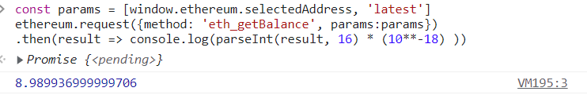
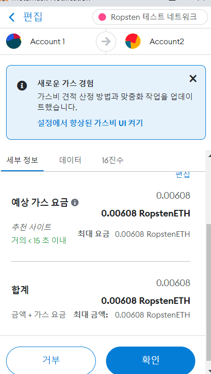
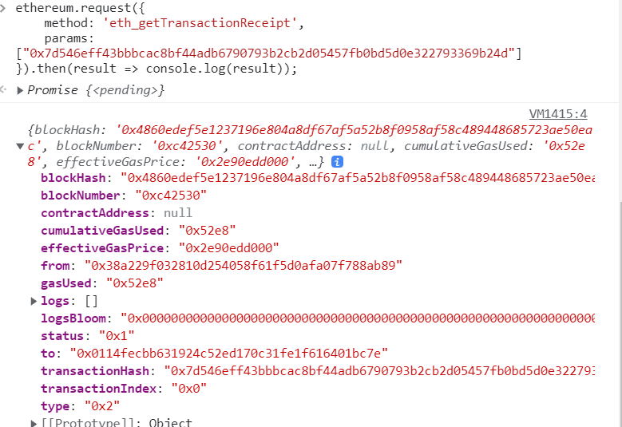
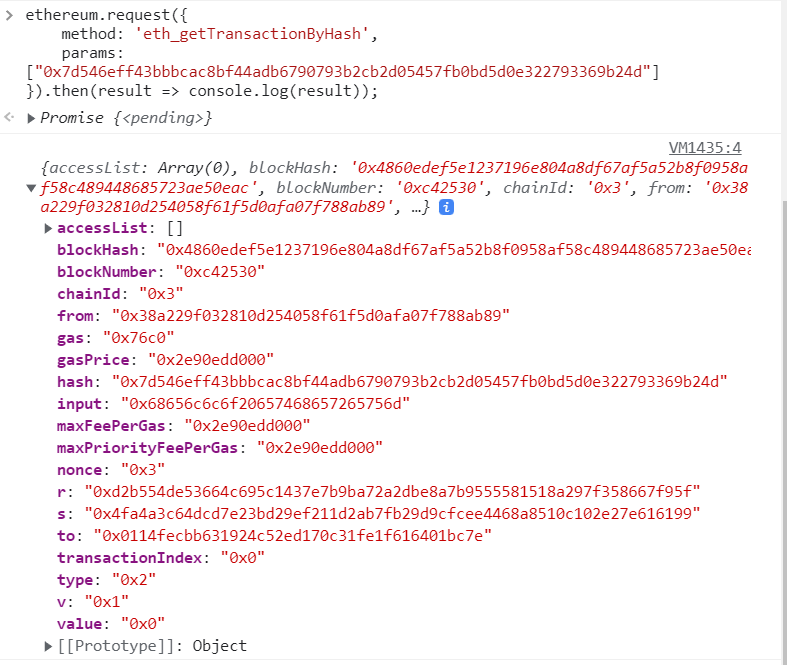
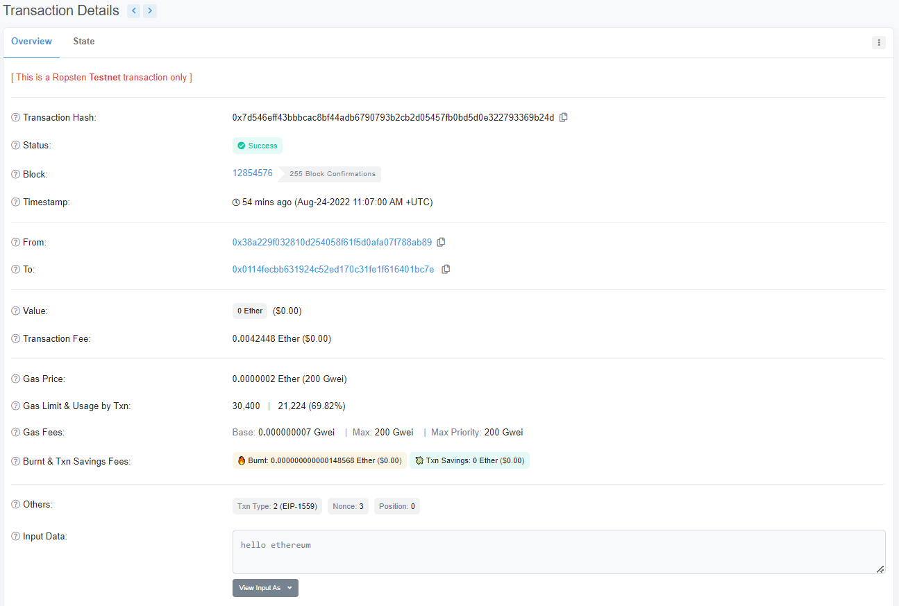

# 1. 소유 계정의 잔액 조회

https://ethereum.org/en/developers/docs/apis/json-rpc/#eth_getbalance

 

```js
const params = [window.ethereum.selectedAddress, 'latest']
ethereum.request({method: 'eth_getBalance', params:params})
.then(result => console.log(parseInt(result, 16) * (10**-18) ))
```

  

# 2-1. 트랜잭션 보내기

https://metamask.github.io/api-playground/api-documentation/

- 호출명령(request)

  ```js
  {
      "jsonrpc": "2.0",
      "method": "eth_sendTransaction",
      "params": [
          {
              "from": "0x38A229F032810D254058F61f5D0afA07f788Ab89",
              "to": "0x0114feCbB631924c52Ed170c31fE1F616401bc7E",
              "value": "0x0",
              "gasPrice": "0x2E90EDD000",
              "gas": "0x76c0",
              "data": "0x68656c6c6f20657468657265756d"
          }
      ],
      "id": 0
  }
  ```

- sign화면

   

- response

  ```js
  {
      "jsonrpc": "2.0",
      "result": "0x7d546eff43bbbcac8bf44adb6790793b2cb2d05457fb0bd5d0e322793369b24d",
      "id": 0
  }
  ```

# 2-2. 트랜잭션 결과 확인

## eth_getTransactionReceipt

- 방법1) metamask playground 호출

  ```js
  {
      "jsonrpc": "2.0",
      "method": "eth_getTransactionReceipt",
      "params": [
          "0x7d546eff43bbbcac8bf44adb6790793b2cb2d05457fb0bd5d0e322793369b24d"
      ],
      "id": 0
  }
  ```

- 방법1) metamask playground 호출 후 응답

  ```js
  {
      "jsonrpc": "2.0",
      "result": {
          "blockHash": "0x4860edef5e1237196e804a8df67af5a52b8f0958af58c489448685723ae50eac",
          "blockNumber": "0xc42530",
          "contractAddress": null,
          "cumulativeGasUsed": "0x52e8",
          "effectiveGasPrice": "0x2e90edd000",
          "from": "0x38a229f032810d254058f61f5d0afa07f788ab89",
          "gasUsed": "0x52e8",
          "logs": [],
          "logsBloom": "0x00000000000000000000000000000000000000000000000000000000000000000000000000000000000000000000000000000000000000000000000000000000000000000000000000000000000000000000000000000000000000000000000000000000000000000000000000000000000000000000000000000000000000000000000000000000000000000000000000000000000000000000000000000000000000000000000000000000000000000000000000000000000000000000000000000000000000000000000000000000000000000000000000000000000000000000000000000000000000000000000000000000000000000000000000000000",
          "status": "0x1",
          "to": "0x0114fecbb631924c52ed170c31fe1f616401bc7e",
          "transactionHash": "0x7d546eff43bbbcac8bf44adb6790793b2cb2d05457fb0bd5d0e322793369b24d",
          "transactionIndex": "0x0",
          "type": "0x2"
      },
      "id": 0
  }
  ```

- 방법2) 크롬 개발자도구에서 호출 / 응답

  - 호출

  ```js
  ethereum.request({
      method: 'eth_getTransactionReceipt',
      params: ["0x7d546eff43bbbcac8bf44adb6790793b2cb2d05457fb0bd5d0e322793369b24d"]
  }).then(result => console.log(result));
  ```

  - 응답

   

## eth_getTransactionByHash

- 방법1) metamask playground

  - 호출

  ```js
  {
      "jsonrpc": "2.0",
      "method": "eth_getTransactionByHash",
      "params": [
          "0x7d546eff43bbbcac8bf44adb6790793b2cb2d05457fb0bd5d0e322793369b24d"
      ],
      "id": 0
  }
  ```

  - 응답

  ```js
  {
      "jsonrpc": "2.0",
      "result": {
          "accessList": [],
          "blockHash": "0x4860edef5e1237196e804a8df67af5a52b8f0958af58c489448685723ae50eac",
          "blockNumber": "0xc42530",
          "chainId": "0x3",
          "from": "0x38a229f032810d254058f61f5d0afa07f788ab89",
          "gas": "0x76c0",
          "gasPrice": "0x2e90edd000",
          "hash": "0x7d546eff43bbbcac8bf44adb6790793b2cb2d05457fb0bd5d0e322793369b24d",
          "input": "0x68656c6c6f20657468657265756d",
          "maxFeePerGas": "0x2e90edd000",
          "maxPriorityFeePerGas": "0x2e90edd000",
          "nonce": "0x3",
          "r": "0xd2b554de53664c695c1437e7b9ba72a2dbe8a7b9555581518a297f358667f95f",
          "s": "0x4fa4a3c64dcd7e23bd29ef211d2ab7fb29d9cfcee4468a8510c102e27e616199",
          "to": "0x0114fecbb631924c52ed170c31fe1f616401bc7e",
          "transactionIndex": "0x0",
          "type": "0x2",
          "v": "0x1",
          "value": "0x0"
      },
      "id": 0
  }
  ```

- 방법2) 크롬 개발자도구에서 호출 / 응답

  - 호출

    ```js
    ethereum.request({
        method: 'eth_getTransactionByHash',
        params: ["0x7d546eff43bbbcac8bf44adb6790793b2cb2d05457fb0bd5d0e322793369b24d"]
    }).then(result => console.log(result));
    ```

  - 응답

     

## Transaction VS Transaction Receipt

- 트랜잭션(거래): 변경될 수 없는 데이터
- 트랜잭션 영수증: 거래가 성공, 실패했을때의 결과가 transaction receipt으로 저장된다. 즉, 완결된 트랜잭션에 대해서만 transaction receipt가 생성된다.
  따라서, transaction receipt에는 추가로 status, logs(트랜잭션 실행 중 생성된 로그 목록), logsBloom(블룸 필터), cumulativeGasUsed(블록의 누적가스 사용량), gasUsed(해당 트랜잭션의 가스 사용량) 정보를 포함한다.


## 이더스캔 조회 결과

https://ropsten.etherscan.io/

```
이더스캔(Etherscan)은 이더리움과 ERC-20 기반의 토큰의 거래내역을 확인할 수 있는 블록 익스플로러입니다. 이더스캔으로는 본인의 거래 내역뿐만 아니라 탈중앙화답게 모든 기록들을 투명하게 확인할 수 있는 실시간 장부
```

 

