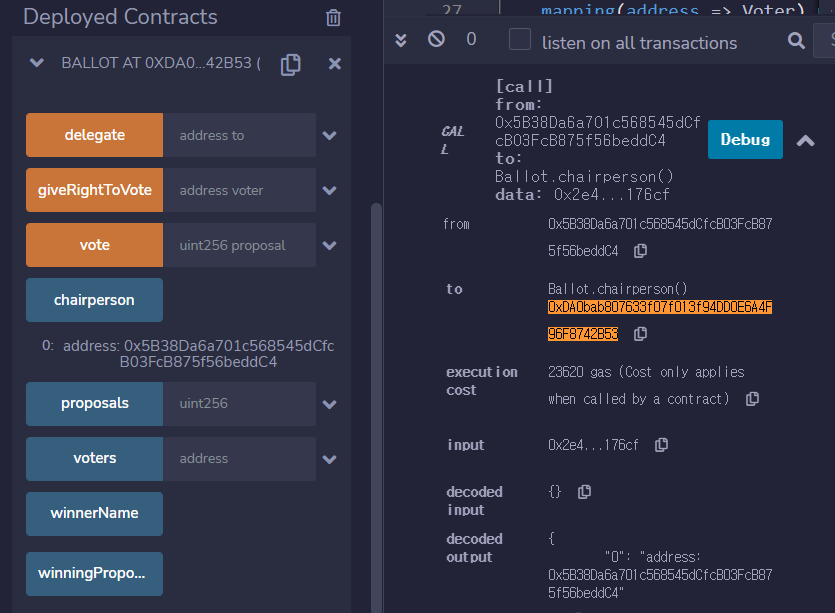

# 1. Remix 에서 3_Ballot.sol 배포

- 4_Convert.sol

  ```solidity
  // SPDX-License-Identifier: GPL-3.0
  
  pragma solidity >=0.7.0 <0.9.0;
  
  contract Converter {
      function stringToBytes32(string memory source) public pure returns (bytes32 result){
          bytes memory bytesString = bytes(source);
          if(bytesString.length == 0) {
              return 0x0;
          }
          assembly {
              result := mload(add(source, 32))
          }
      }
  } 
  ```

   

   

  ```
  기호 1, 2, 3
  ["0xeab8b0ed98b83100000000000000000000000000000000000000000000000000",
  "0xeab8b0ed98b83200000000000000000000000000000000000000000000000000",
  "0xeab8b0ed98b83300000000000000000000000000000000000000000000000000"]
  ```

   

  

# 2. 상태변수의 의미 알기

- chairman, proposals 변수를 호출해보고 어떤 값이 할당되어 있는지 설명합니다.

## 1. chairperson

- 배포 주소: 0xDA0bab807633f07f013f94DD0E6A4F96F8742B53
- chairperson실행 -> 컨트랙트 배포를 수행한 주소가 할당되어 있다.  
  - 0x5B38Da6a701c568545dCfcB03FcB875f56beddC4

	## 2. proposals

- 컨트랙트 배포 시 입력했던 bytes32의 값이 할당되어 있다. 범위를 초과하는 데이터 요청 시 에러가 발생한다.

 

- 범위 초과

  

# 3. 함수 및 변수 호출하기

### 1. delegate() 함수 호출 시

 

- from: chairman의 주소
- decoded input: 투표권을 부여할 주소
  - 0xDA0bab807633f07f013f94DD0E6A4F96F8742B53

### 2. vote()함수 호출 시

 

- from: 1에서 지정한 주소
- decoded input: 투표할 proposal 번호

### 3. voters ()호출 시

 

- decoded input: 검색한 주소
- decoded output: 결과

### 4.  1)2) 와 3)의 차이점

- 호출 시 1) 2)와 다르게 call로 나타난다.
- 터미널 영역의 결과를 자세히 확인해보면 1) 2)에서는 transaction cost/execution cost가 발생한 반면 3)에서는 비용이 발생하지 않는다.


# 4. 3_Ballot을 Ropsten 테스트넷에 배포하기

- Remix환경과 metamask를 이용하여 ropsten 네트워크에  3_ballot.sol 컨트랙트를 배포합니다.

- 배포 전 deploy &  transaction 환경설정

  - ropsten network

  -  

    

- 배포 요청 시 metamask알림 화면 캡쳐

  -  

- 배포 완료화면 - 이더스캔 화면 캡쳐와 링크

  - [링크](# https://ropsten.etherscan.io/tx/0xbcfb3192f589db2b323b80eef98e2a3104da71a2e960a3b6a01705aa658c5913)
  -  

- injected web3는 무엇을 의미하는가 ?

  inject는 주입하다라는 뜻으로 injected web3를 선택하면 말 그대로 브라우저 상에서 3rd party에 의해 '주입된 web3'환경을 사용한다는 뜻이 된다.

  과제 4의 경우, 해당 환경을 선택함으로써, metamask 지갑에 의해 주입된 환경인 ropsten네트워크와 metamask에 설정된 계정을 그대로 remix환경에서 사용할 수 있게 된다.
