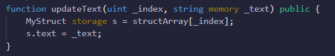

# 1. Data location 비교하기

- memory, storage 키워드

- 참조형 자료형(object(배열 등)..)에는 datalocation이 존재

- memory, storage, calldata 비교하기

  -  
  - storage
    - 영구 데이터(permanent data) 영역에 데이터를 저장한다. 컨트랙트의 상태변수가 storage영역에 저장된다. 따라서, 이 키워드는 다른 키워드에 비해 큰 비용을 초래한다.
  - memory
    - **함수 안에서** 사용되는 임시 데이터(temporary data)를 저장하는데 사용한다.
  - calldata
    - 함수에 전달되는 **매개변수** 같은 변경 불가하고, 임시적인 데이터가 저장되는 영역이다.

  

# 2. 할일 컨트랙트 구현하기

 

- 상태변수 및 함수 선언
- struct 및 array의 용법 활용
- create, update, toggle, get 함수 구현