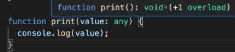

# primitives

- number
- string
- boolean


```tsx
let age: number;
age = 12
---
let age: number = 12
```

```tsx
let userName: string;
userName = 'Max'
```


# complex types

- arrays, objects

```tsx
let hobbies: string[];
hobbies = ['sport','cook'];

//이렇게 사용할수도 있지만, 그럼 타입스크립트를 사용하는 이유에 반대됨
//JS와 다를게 없음
let person: any;
person = {
    name:'Max',
    age:32
}
```

```tsx
//객체의 타입 정의
let person: {
    name; string;
    age: number;
};

//person = {
//	isEmployee: true  //boolean이라 위에 정의된 타입과 안맞아서 에러 뜸
//}

//person 배열로 만들기
let person: {
    name; string;
    age: number;
}[];
```


# 타입추론

```tsx
//type inference
let course = 'react - the compolete guide'  //let course: string 불필요
// course = 12341;  //error
```

- 타입을 굳이 명시해주지 않아도 됨. 
- 처음에 정의된 타입을 읽어서 그 타입대로 다음 변수를 읽음.


# 유니온 유형

- 하나에 다양한 변수를 저장하게 될 수도 있음
- 한개 이상의 타입을 지정해줘야하는 경우

```tsx
let course: string | number= 'react - the compolete guide' 
course = 12341; 

let userName: string | string[];
```


# 타입별칭

- type alias

```tsx
//객체의 타입 정의
let person: {
    name; string;
    age: number;
};

//person 배열로 만들기
let person: {
    name; string;
    age: number;
}[];
```

반복해서 타입을 정의하지 않는다.

```tsx
type Person = {
    name; string;
    age: number;
}
//type Person은 타입스크립트에만 존재하는 기능 -> JS로 컴파일하면 없어짐

let person: Person;
let person: Person[];
```


# function types, parameters

- 반환값의 타입도 생각해야함

```tsx
//함수타입 추론
function add(a: number, b: number){
    return a + b;
}
//함수타입 지정
function add(a: number, b: number):number | string{
    return a + b;
}
```

 

- void: 함수에 반환값이 없다는 것을 뜻함

```tsx
function print(value: any){
    console.log(value)
}
```

