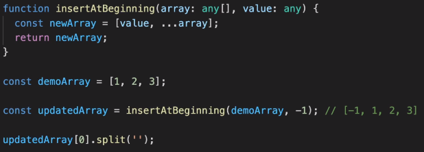

# Generics

 

updatedArray의 값이 숫자임을 typescript는 알 수 없다.

이미 insertAtBeginning function에서 **any라는 타입을 지정했기 때문**이다.


```tsx
// array와 value가 같은 타입을 가져야한다는걸 알려줌
function inserAtBeginning<T>(array: T[], value: T){
    const newArray = [value, ...array];
    return newArray
}

const demoArray = [1, 2, 3];
//그렇게 되면 typescript는 demoarray의 타입을 볼 수 있고, 그러면 숫자배열임을 알 수 있다!
const updatedArray = insertAtBeginning(demoArray, -1); //[-1, 1, 2, 3]
const stringArray = insertAtBeginning(['a', 'b', 'c'], 'd')
updatedArray[0].split('');
```

