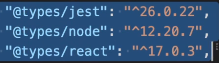
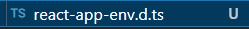
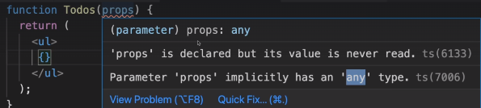
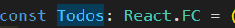
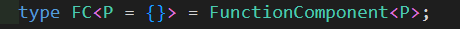

[react+txs](# https://create-react-app.dev/docs/adding-typescript)

```bash
npx create-react-app my-app --template typescript
```

- jsx파일 대신 tsx 사용하기

- ts코드를 js코드로 컴파일함

- dont need to compile ts -> js

  ```bash
  npm run build
  //쓰면 됨
  ```

- pakage.json

  ```json
  typescripts: 타입스크립트용 컴파일러
  ```

  - types pakage는 `js library`와` ts `사이의 번역기 역할을 함
  - 즉, 타입표시를 js에 추가해줌

   

   타입스크립트와 프로젝트를 연결해줌

---

 

- props로 내리는 값의 타입을 정해주지 않아 ts가 경고
- 타입을 전혀알아낼수 없다고 보는 것 같으므로..


### 함수 정의 React.FC

리액트 패키지에 내장된 또 다른 타입의 정의

FC(functional components): 이 함수가 함수형 컴포넌트로 동작한다는 의미

 (click FC ㄱ )

 

- app.tsx

  ```tsx
  import Todos from './components/Todos'
  
  function App() {
    return (
      <div>
        <Todos items={['Learn React', 'React Practice']}/>
      </div>
    );
  }
  
  export default App;
  ```

- Todos.tsx

  ```tsx
  //props는 다 객체
  //items를 키로, 문자열배열을 값으로 갖는다.
  import React from "react"
  
  // 내부적으로 사용되는 제네릭 타입에 구체적인 값을 집어넣는다. 
  // React.FC<{}> 
  // props객체를 넣을 수 있다.
  const Todos: React.FC<{items: string[]}> = (props) => {
    return (
      <ul>
        {props.items.map(item => <li key={item}>{item}</li>)}
      </ul>
    )
  }
  
  export default Todos
  ```

- tsconfig.json

  ```json
  {
    "compilerOptions": {
      "target": "es5", //target js버전 설정
      //기본 타입스크립트 라이브러리
      "lib": [
        "dom", //ex) dom -> htmlinputelement지원
        "dom.iterable",
        "esnext"
      ],
      "allowJs": true, //js파일 포함 여부
      "skipLibCheck": true,
      "esModuleInterop": true,
      "allowSyntheticDefaultImports": true,
      "strict": true, //중요, any 타입을 쓸 수 없는 strict mode.
      "forceConsistentCasingInFileNames": true,
      "noFallthroughCasesInSwitch": true,
      "module": "esnext",
      "moduleResolution": "node",
      "resolveJsonModule": true,
      "isolatedModules": true,
      "noEmit": true,
      "jsx": "react-jsx" //옵션으로 jsx를 지원할것인지
    },
    "include": [
      "src"
    ]
  }
  ```

  
