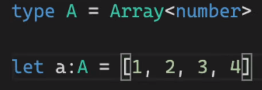

[타입스크립트로 블록체인 만들기](# https://nomadcoders.co/typescript-for-beginners/)
[typescript playground](# https://www.typescriptlang.org/play?#code/PTAEHUFMBsGMHsC2lQBd5oBYoCoE8AHSAZVgCcBLA1UABWgEM8BzM+AVwDsATAGiwoBnUENANQAd0gAjQRVSQAUCEmYKsTKGYUAbpGF4OY0BoadYKdJMoL+gzAzIoz3UNEiPOofEVKVqAHSKymAAmkYI7NCuqGqcANag8ABmIjQUXrFOKBJMggBcISGgoAC0oACCbvCwDKgU8JkY7p7ehCTkVDQS2E6gnPCxGcwmZqDSTgzxxWWVoASMFmgYkAAeRJTInN3ymj4d-jSCeNsMq-wuoPaOltigAKoASgAywhK7SbGQZIIz5VWCFzSeCrZagNYbChbHaxUDcCjJZLfSDbExIAgUdxkUBIursJzCFJtXydajBBCcQQ0MwAUVWDEQC0gADVHBQGNJ3KAALygABEAAkYNAMOB4GRonzFBTBPB3AERcwABS0+mM9ysygc9wASmCKhwzQ8ZC8iHFzmB7BoXzcZmY7AYzEg-Fg0HUiQ58D0Ii8fLpDKZgj5SWxfPADlQAHJhAA5SASPlBFQAeS+ZHegmdWkgR1QjgUrmkeFATjNOmGWH0KAQiGhwkuNok4uiIgMHGxCyYrA4PCCJSAA)

:star: **타입스크립트가 타입을 추론하도록, 최소한의 타입을 명시한다.**

[TOC]

# Overview

## object를 타입으로 명시해주는 법

```typescript
let a : type
argument: type
function funcname: type
cosnt funcname = (argument: type): type => ({argument})
```

- 예시

```typescript
const playerNico = {
    name:string,
    age?:number
} = {
    name: 'nico'
}
------------------------------
type Age = number
type player: {
    name:string,
    age?:Age
}
const playerNico: Player = {
    name: 'nico'
}
```

- func

```typescript
function playerMaker(name:string): Player{ //Player라는 타입을 정해줌으로써, age가 number임을 알수 있음
    return {
        name: name //name
    }
}
const nico = playerMaker('nico')
nico.age = 12
```

- arrow func

```typescript
const playerMaker = (name: string): Player => ({name})
```

- readonly property 만들기

```typescript
type player: {
    readonly name:string,  //readonly 명시
    age?:number
}
//---
const numbers: readonly number[] = [1, 2, 3, 4]
```

---

## Tuple

- tuple을 명시하면 배열을 만들 수 있음
- 특정 위치에 특정 타입이 있어야 함.

```typescript
const player: [string, number, boolean] = ['nico', 12, false]
const player: readonly [string, number, boolean] = ['nico', 12, false]
//---
let a: undefined = undefined
let b: null = null
//---
type Player = {
    age?:number //number || undefined
}
//---

```

---

## type checker

```typescript
let a: unknown;
if(typeof a === 'number'){
    let b + a + 1
}
if(typeof a ===  'string'){
    let b = a.toUpperCase();
}
```

### void

- 비어있는, return이 없는 함수
- 써도되고, 안써줘도 됨

```tsx
function hello(): void{
	console.log('x')
}
```

### never

- never return, throw error

```tsx
function hello(): never {
    throw new Error("xxx")
}
//
function hello(name: string|number): never {
    if(typeof name=== "string"){
        name
    }else if(typeof name === "number"){
        name
    }else{ // type never
        name
        throw new Error("xxx")
    }
}
```

---

# Function

```tsx
function add(a: number, b: number) {
    return a + b
}
//function return number
```

- :star: arrow func

```tsx
const add = (a: number, b: number) => a + b // number를 계속 명시해줘야함
```

```tsx
//props로 내릴때 많이 사용하게 될 것
type Add = (a: number, b: number) => number
const add: Add = (a, b) => a + b
```

## :star: overloading

- 대략적인 예시

```tsx
type Add ={
    (a: number, b: number): number
	(a: number, b: string): number  //여러 call signature가 있음
}

const add: Add = (a, b) => {
    if(typeof b === "string") return a
    return a + b
}
```

- next.js에서 `Router.push`를 할때 많이 사용함.

```typescript
type Config = {
    path: string, 
    state: object
}
type Push = {
    (path: string): void
    (config: Config): void
}
const push: Push = (config) => {
    if(typeof config === "string") {console.log(config)}
    else{
    	console.log(config.path, config.state)
	}
}
```

- 여러개의 argument를 가지고 있을때

```typescript
type Add = {
    (a: number, b: number): number
    (a: number, b: number, c: number): number,  //c parameter is option
}
const add: Add = (a, b, c?:number) = { //아마도 c는 숫자일 것이다.
    if(c) return a+b+c
    return a + b
}
```

## :star: Polymorphism (generic)

- many different shapes
- generic type: placeholder(in generic...)
- concrete type: number, boolean, string, void, unknown..

- generic type 사용X

```typescript
type SuperPrint = {
    (arr: number[]): void
    (arr: boolean[]): void
    (arr: string[]): void
    (arr: (number|boolean)[]): void
}
const superPrint: SuperPrint = (arr) => {
    arr.forEach(i=>console.log(i))
}
superPrint([1, 2, 3, 4])
superPrint([true, false, true])
superPrint(["1", "2", "3"])
superPrint([1, 2, true, false])
```

- generic type 사용O
- TypePlaceholder는 타입스크립트가 알아낸 값으로 변경해줌

```typescript
type SuperPrint = {
    <TypePlaceholder>(arr: TypePlaceholder[]): void
}
const superPrint: SuperPrint = (arr) => {
    arr.forEach(i=>console.log(i))
}
superPrint([1, 2, 3, 4])
superPrint([true, false, true])
superPrint(["1", "2", "3"])
superPrint([1, 2, true, false])
//---
type SuperPrint = {
    <TypePlaceholder>(arr: TypePlaceholder[]): TypePlaceholder //변경
}
const superPrint: SuperPrint = (arr) => arr[0]   //TypePlaceholder의 [0]을 return 받음
const a = superPrint([1, 2, 3, 4])
const b = superPrint([true, false, true])
```

- 많이 보게될 구조

```typescript
type SuperPrint = {
    <T>(arr: T[]): T
} //타입스크립트에게 타입을 알아내도록함
```

## Generic Recap

- 제네릭은 선언 시점이 아니라 생성 시점에 타입을 명시하여 하나의 타입만이 아닌 다양한 타입을 사용할 수 있도록 하는 기법이다.

```typescript
type SuperPrint =  <T, M>(a: T[], b:M) => T

const superPrint: SuperPrint = (a) => a[0]

const a = superPrint([1, 2, 3, 4], "x")
const b = superPrint([true, false, true], 1)
```

## Conclusions

`example code`

```typescript
type SuperPrint =  <T,M>(a: T[], b:M) => T

const superPrint: SuperPrint = (a) => a[0]
// ===>  하나의 함수로 교체
function superPring<V>(a:V[]){
    return a[0]
}
const a = superPrint([1, 2, 3, 4])
//overriding △ 타입스크립트가 타입을 유추하게두도록 한다.
const a = superPrint<number>([1, 2, 3, 4])
```

```typescript
type Player<E> = {
    name: string,
    extraInfo: E
}
//
type NicoPlayer = Player<{favFood:string}>
//
type NicoExtra = {
    favFood: string
}
type NicoPlayer = Player<NicoExtra>
//


const nico: Player<{favFood:string}> = {
    name: "nico",
    extraInfo:{
        favFood: "kinchi"
    }
}

const lynnn: Player<null> = {
    name: 'lynn',
    extraInfo: null
}
```

 

- 두가지 방법으로 사용할 수 있음.

```typescript
function printAllNum(arr:number[])
function printAllNum(arr: Array<number>)
```

```typescript
useState<number>()
```

---

# Classes and InterFaces

## classes

- private, public, protected은 자바스크립트에서 보이지 않는다.

```typescript
class Player {
    constructor(
        private firstName: string,
        private lastName: string,
        public nickname: string
	) {}
}
const nico = new Player("nico", "las", "니꼬")

// error // -private
nico.firstName;
```

```typescript
//추상클래스
abstract class User{    
    constructor(
        private firstName: string,
        private lastName: string,
        public nickname: string
	) {}
    //추상메소드: 추상클래스 안의 메소드(함수)인데 이렇게 쓰면 안됨. (밑에 보기 -> callsignature)
    getFullName(){ //public
        return `${this.firstName} ${this.lastName}`
    }
}
const Player extends User {
    
}

// error // -추상클래스는 그저, 다른 클래스에서 상속받기 위한것으로 직접적으로 인스턴스를 만들 수 없음.
const nico = new User("nico", "las", "니꼬")
nico.getFullName()
```

```typescript
//추상클래스
abstract class User{    
    constructor(
        private firstName: string,
        protected lastName: string,
        private nickname: string
	) {}
    //callsignature
    //추상메소드는 추상클래스를 상속받는 모든 것들이 구현해야하는 메소드! 라서,
    //상속받는 클래스가 이를 구현하지 않을시 오류를 반환함
   	abstract getNickName(): void
    abstract fullName(name:string):string
}

class Player extends User{
    getNickName(){
        console.log(this.firstName) // private로 선언됐을땐, 접근불가 error
        console.log(this.lastName) // protected로 선언되면 상속 후 접근 가능
    }
}
```

## Recap

```typescript
// Words타입이 string만을 property로 가지는 오브젝트 라는것을 말함
// 제한된 프로퍼티를 갖도록함
// key가 제한되지 않은 오브젝트를 정의할 수 있음
type Words = {
    [key: string]: string
}
//ex)
let dict: Words = {
    "potato": "food"
}
//
class Dict {
    private words: Words,
    constructor(){
        this.words = {} // 수동으로 초기화
    }
    // 클래스를 타입처럼 사용
    add(word: Word){
        if(this.words[word.term] === undefined){
            this.words[word.term] = word.def
        }
    }
    def(term: string) {
		return this.words[term];
	}
	update(word: Word) {
		if (this.words[word.term] !== undefined) {
        this.words[word.term] = word.def;
    	}
    }
    del(term: string) {
    if (this.words[term] !== undefined) {
    delete this.words[term];
    	}
	}
    static hello(){ // static method
        return "hello"
    }
}

class Word {
    constructor(
        public readonly term:string, //readonly로 public선언시 밖에서 수정할 수 없도록.
        public readonly def: string
    ) {}
}

const kimchi = new Word("kimchi", "한국의 음식")

const dict = new Dict()
dict.add(kimchi);
dict.def("kimchi")
dict.update(new Word("kimchi", "very incredible super food"));
dict.del("pizza");

Dict.hello()
```


## Interface

- ts에게 obj의 모양을 알려주는 방법
  - type: 좀 더 쓰임이 많음
  - interface: **오직 obj**의 모양을 ts에게 설명해주기 위해서 사용됨
- 비교를 위한 예시( **type** )

```typescript
type Team = 'red' | 'blue' | 'yellow'
type Health = 1 | 5 | 10
type Player = {
    nickname:string,
    team: Team,
    health: Health
}
const nico: Player = {
    nickname: 'nico',
    team:'red',
    health: 1
}
```

- **Interface**

```typescript
type Team = 'red' | 'blue' | 'yellow'
type Health = 1 | 5 | 10
//type은 여러가지를 만들 수 있지만
//interface는 오직 obj를 위한, 한가지 목적을 가짐
interface Player {
    nickname: string,
    team: Team,
    health: Health
}

const nico: Player = {
    nickname: 'nico',
    team:'red',
    health: 1
}
```

---

```typescript
//interface
interface User {
    name: string
}
interface Player extends User {
}
//same as type
type User = {
    name: string
}
type Player = User & {
}
// use
const nico: Player = {name: "nico"}
```

-> 인터페이스가 객체지향프로그래밍의 개념을 활용해 디자인되어 타입보다 보기 편함

- 또한 인터페이스는 같은 인터페이스에 다른 이름을 가진 property를 쌓을 수 있음

```typescript
interface User {
    name: string
}
interface User {
    lastName:string
}
const nico : User = {
    name: 'nico',
    lastname: 'las'
}
```

---

## Interface with Class

- 추상화 사용시, 클래스와 인터페이스를 사용할때의 차이

```typescript
//추상클래스는 자신으로부터 인스턴스를 만드는 것을 허용하지 않음
abstract class User{    
    constructor(
        protected firstName: string,
        protected lastName: string,
        protected nickname: string
	) {}
    abstract sayHi(name: string): string
   	abstract fullName(): string
}
//error// new User() 
class Player extends User{
    fullName(){
        return `${this.firstName} ${this.lastName}`
    }
    sayHi(name: string){
        return `Hello ${name}. My name is ${this.firstName}`
    }
}
```

- 자바스크립트에는 추상클래스가 없어서, 결국 클래스 형태로 바꿈
  - 추상클래스를 사용하는 이유? 표준화된 프로퍼티와 메소드를 갖도록 하기 위해서
- 인터페이스는 컴파일하면 JS로 바뀌지 않고 사라짐
- 추상클래스 대체 (type, interface)

```typescript
//인터페이스를 만들어두고, 팀원이 각자 원하는 방식으로 클래스를 상속하도록 
//class가 아니지만, 클래스의 모양을 특정하게 해줄 수 있는 방법
interface User{   
    firstName: string,
    lastName: string,
    nickname: string,
    sayHi(name: string): string,
    fullName(): string
}
interface Human {
    health: number
}
//장점: implements를 사용함으로써,위의 interface User가 자바스크립트에서 보여지지 않음 (type, interface)
//단점: 인터페이스를 상속할 떄는 propety를 private으로 만들지 못함.
class Player implements User, Human{  //하나의 클래스에서 여러개의 인터페이스를 상속받을 수 있음
    constructor(
         public firstName: string,
         public lastName: string,
         public nickname: string,
         public health: number
	) {}
    fullName(){
        return `${this.firstName} ${this.lastName}`
    }
    sayHi(name: string){
        return `Hello ${name}. My name is ${this.firstName}`
    }
}
```

- 클래스, 인터페이스 모두 타입으로 쓸 수 있음.
- interface라서 new User를 해주지 않아도 됨

```typescript
function makeUser(user: User){ 
    return "hi"
}
makeUser({
    firstName:'nico',
    lastName:'las',
    fullName:() => 'xx',
    sayhi: (name) => "string"
})
//same
function makeUser(user: User): User{
   return {
       firstName:'nico',
        lastName:'las',
        fullName:() => 'xx',
        sayhi: (name) => "string"
   }
}
```

## Recap

- 인터페이스가 하는일은 타입도 함 △ 인터페이스는 상속 후  같은 인터페이스에 다른 이름을 가진 property를 쌓을 수 있음

- 인터페이스 사용: 타입스크립트에게 오브젝트의 모양을 알려주기 위해
  그외: 타입

---

## :star: Polymorphism (generic)

```typescript
interface SStorage<T> {
    [key: string]: T
}
class LocalStorage<T> {
    private storage: SStrorage<T> = {}
	set(key:string, value:T){
        //API디자인
        this.storage[key] = value;
    }
    remove(key:string){
        delete this.storage[key]
    }
    get(key:string):T {
        return this.storage[key]
    }
    clear(){
        this.storage = {}
    }
}

const stringStorage= new LocalStorage<string>() //<string> -> value:string
stringStorage.get("ket") //key
stringStorage.set("hello", "how are you") //key, value

const booleansStorage = new LocalStorage<boolean>() //<boolean> -> value:boolean
booleansStorage.get("xxx") //get(key:string):boolean
booleansStorage.set("hello", true)
```


