- [docker설치](https://docs.docker.com/get-docker/)
- wsl세팅
  - 제어판 hyper-v 켜기
  - cpu 가상화 설정

```bash
docker --version
docker run -d -p 9002:8080 -p 50000:50000 -v /var/jenkins:/var/jenkins_home -v /var/run/docker.sock:/var/run/docker.sock --name jenkins3 -u root jenkins/jenkins:lts-jdk11
> http://localhost:9002 접속
docker logs jenkins3 - 비밀번호 확인
```

```
이때, 위에 명시된 jenkins3이라는 name을 같게 맞추어주어야한다.
```

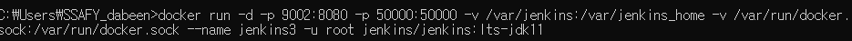

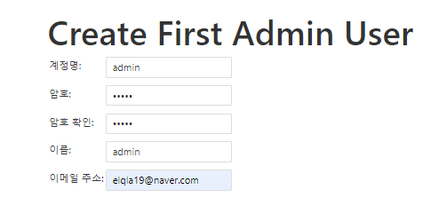 

http://localhost:9002/


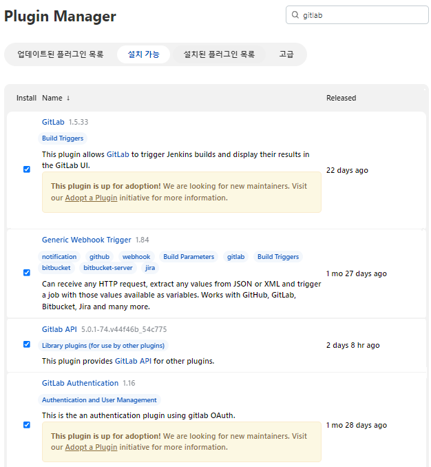 

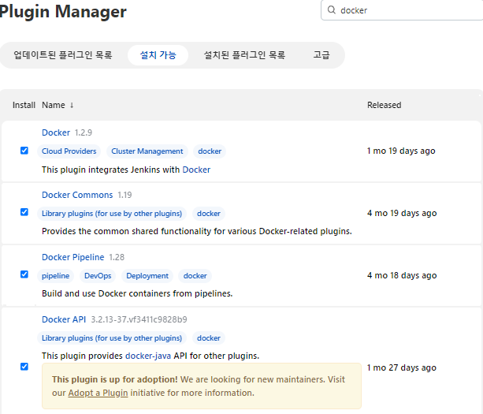 

jenkins 컨테이너안 도커 설치

```
컨테이너 진입: docker exec -it jenkins3 bash
도커 설치: curl https://get.docker.com/ > dockerinstall && chmod 777 dockerinstall && ./dockerinstall
```


- 도커라이징 및 배포 설정

  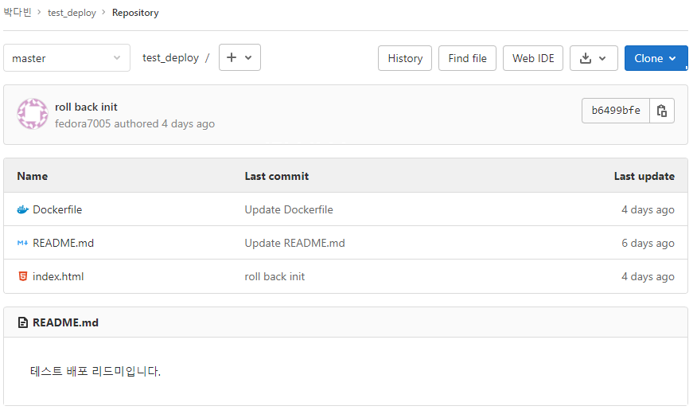 

```
jenkins에서 newitem클릭
```

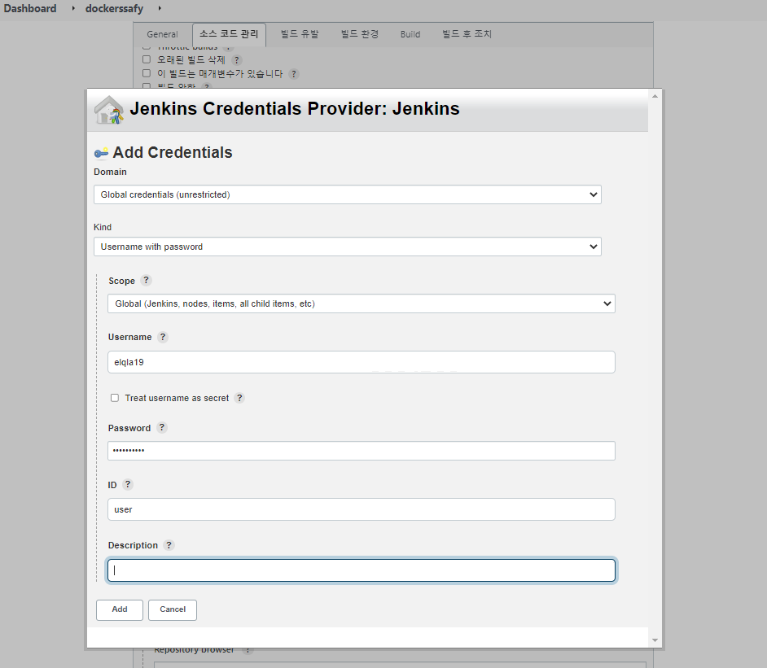 


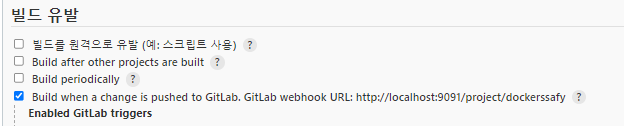 

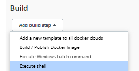 

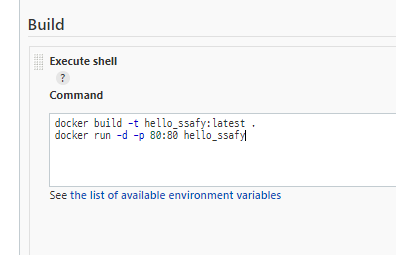 

```
docker build -t hello_ssafy:latest .
docker run -d -p 85:80 hello_ssafy # 80:80등 사용하지 않는 포트 적기
```

build now click

 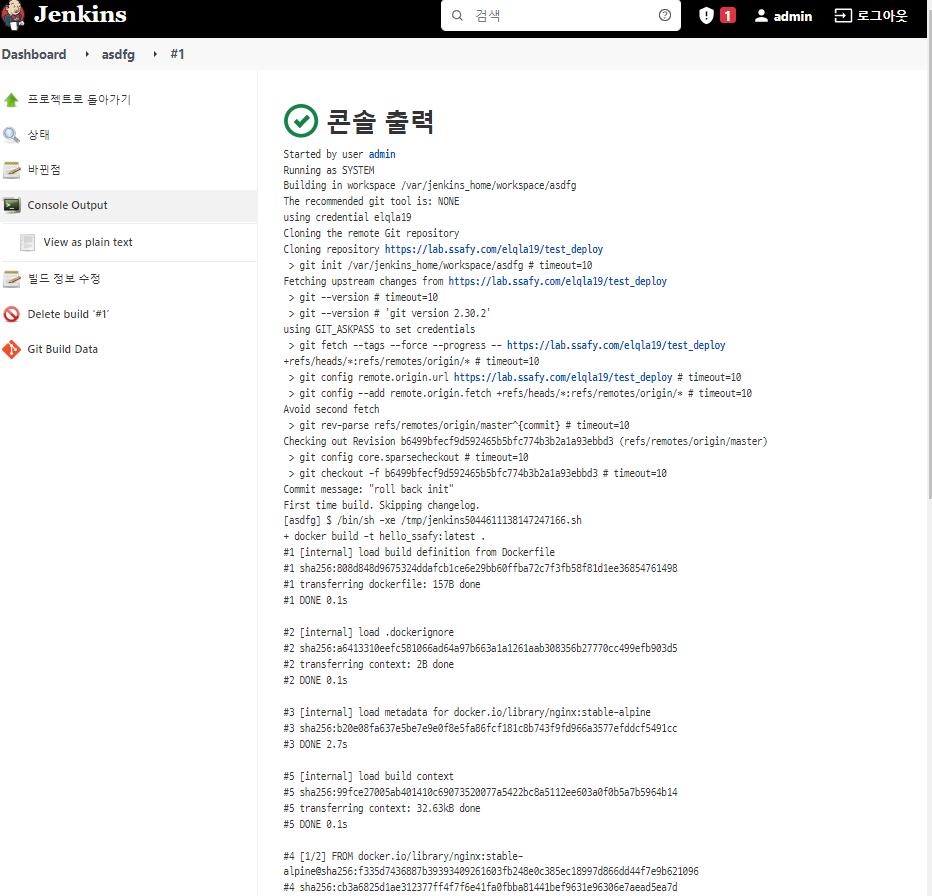 


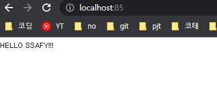 

```
npm run build         ##vue 설치
```

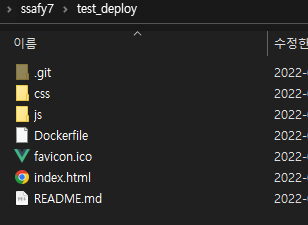 dist안의 것들을 밖으로 빼줌

```
docker build -t hello_ssafy:latest .
docker run -d -p 86:80 hello_ssafy    # 포트 변경
```


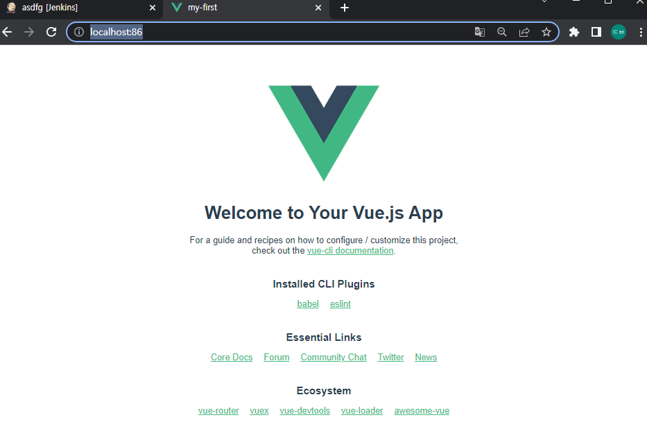 

