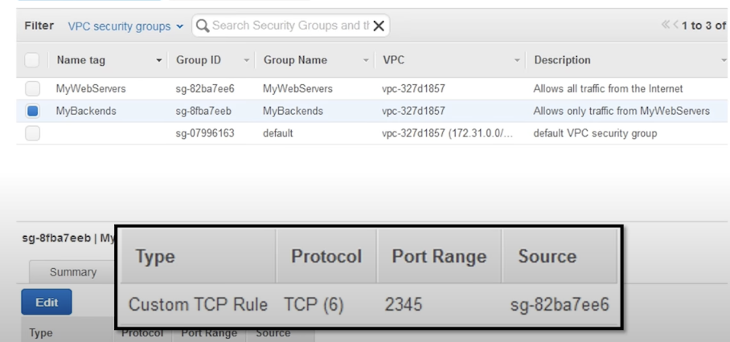

## 1. 인터넷에 연결된 VPC 만들기: 단계별

- IP 주소 범위 선택

- 가용영역(AZ)별 서브넷 설정

- 인터넷으로 향하는 경로(route)만들기

- VPC로 부터의 트래픽 설정

### (1) IP 주소 범위 선택

CIDR: classless inter domain router

RFC에 명시된, 1918에 명시된 ip주소를 vpc의 프라이빗 addr로 쓸 것을 권장함.

16이라는 값을 가지는 vpc

public하게

### (2) 서브넷

- avaliablity zone 의 서브넷을 나눠서 만듦

- 172.31.0.0/24 // 주소가 달라야 함
- 172.31.0.2/24

### (3) route

- destination 목적지는 내 vpc, 내 vpc로 향하는 트래픽은 내 vpc내에 머물러야 함

- internet gateway로 나감(igw~~)

(사진 위 - local vpc, 내부에서만 패킷을 보낼 수 있는)
(사진 아래 - gateway/ 0.0.0.0/0 anywhere \_\_ vpc로 향하지 않는건 모두 인터넷으로 보냄)

### (4) traffic setting

## 2. VPC의 네트워크 보안

### (1). Network ACLs: Stateless firewalls

- subnet단위로 적용 가능

- Security Groups: 애플리케이션 구조

  - webserver, backserver
  - mywebservers (security), mybackends(security) \_\_mybackserver 웹서버만 백서버로 접근하게 하고 싶을것

aws 장점: auto scailing

 

 

frontend는 어디서든 접근가능하게 하고, backend보안그룹에 프론트엔드 groupid를 소스로 넣으면, 오토스케일링될때 저거만 붙이면 되기때문에 자유롭고 안전하게 됨.
원하는 포트의 트래픽만 받을 수 있음.

### (2). : Statefull firewalls

- statefull: inbound(들어오는트래픽이 올 시) 들어오는 커넥션을 기억, response를 보낼때 들어올때 허용되었기때문에 나가는것도 허용 (간단)
- 인바운드만 허용

- stateless: inbound때 열어줬으면, 나가는것도 열어줘야함. 근데 나가주는걸 열어주는게 정해진거만 해줄 수가 없음. client는 os마다 다양함. 1024번 포트인 웰론 포트말고 클라이언트인 1025번부터 6만...이 포트를 열어주게끔 설정해줘야함. (networkacl)

- 필요없는 security그룹은 열어주지 말자. (최소 권한 원칙 준수)

- 예를 들면 ssh 인 22번 포트로 관리 목적으로 방화벽을 열어두면, source address를 회사의 ip만 열어두면 되는 것임.

## 3. VPC 연결 옵션

### (1) 인터넷 엑세스 제한: 서브넷별로 다른 라우팅

- NAT gateway: 아웃바운드 전용 인터넷 허용

- 프라이빗/퍼블릭 vpc subnet 분리 ..

- 밖의 레포지토리 및 배포 등 해야하는데, 이는 nat gateway로 제공됨.

왼쪽의 서버들은 nat gateway를 통해 public하게 왔다갔다 다운받고 전달받고 함.
-> 이점: 외부에서 private에 들어갈수가 없음.

how ?

-> igw가 아니라 nat-..를 타겟으로 해주면 됨.

## 4. VPC간 연결 (VPC peering)

### (1) VPC peering 사용 예: 공유 서비스 VPC

공통/핵심 서비스 (공통유저)

- 인증/디렉토리
- 모니터링
- 로깅
- 원격관리
- 스캐닝

## 5. 온프레미스와 vpc 연결

### (1) 회사 네트워크에 연결 , virtual private network(vpn) & direct connect(dx)

- AWS VPN basics \_ customer gateway 또는 AWS의 virtual gateway

## 6. VPC 및 다른 AWS 서비스와의 관계

### (1) RDS database in your vpc

- vpc 안에 rds 위치 시켜야 private하게 쓸 수 있음.

### (2) lambda function in your vpc (redshift, elastic cash, eelastic search, ..)

VPC를 제대로 만들어야함.

### (3) S3 and your VPC

- S3는 인터넷에 연결만 되있으면 연결가능해야하기때문에 vpc에 위치하지 않아야함
- 보안 관점에서 s3의 ip는 고정되있지 않음.
- 만약 outbound traffic을 적용해야하는 회사의 경우 vpc endpoints for s3를 사용할 수 있음

### (4) IAM policy for vpc endpoints

- IAM policy at vpc endpoint: 특정 s3 버킷엑세스만 허용

## 6. VPC Flow logs: VPC traffic metadata CloudWatch Logs

- Network ACL, 등 로그가 제공됨. createFlowLog (enable)

/_
정리
VPC network를 availability zone 별로 만들고, acl로 방화벽 정책 만들고
특정 서브넷은 인터넷으로 가는 관문, 경로 지정
_/

--- 참고 ---
https://www.youtube.com/watch?v=R1UWYQYTPKo&t=315
----------

## 추가로 정리

Q. natgateway써서 private, public을 연결할때 추가비용이 드는데 꼭 연결해야할까?

A. private의 ecs fargate server에서 ecr 이미지 가져올때 필요해서 사용(이는 vpc endpoint로도 할 수 있음)

A. aws외부에 있는게 아닌이상 vpc endpoint로도 가능(다만 유지비용 + 데이터 처리비용 생각해야함)

A. private 에 있는 server에서 문자전송 서비스로 요청 보낼때 origin ip가 고정되어야 해서 사용 

  - server는 private이라 public ip가 없으니, public e2를 프록시로 두고(고정ip), 전송요청만 해당 server로 나가도록
  - private인스턴스를 그대로 public에 만들고, alb에서 경로에 따라 타겟그룹 분기 설정을 할 수 있음. 문자전송 api만 public인스턴스로 향하도록

Q. EC2가 public, RDS가 private에 있는게 일반적인 구조 아닌가? 이때도 endpoint를 쓰는게 가능한가

A. ec2에서 database 접근하는 어플리케이션이 돌아간다면 ec2도 private에 넣는게 좋다.

