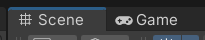
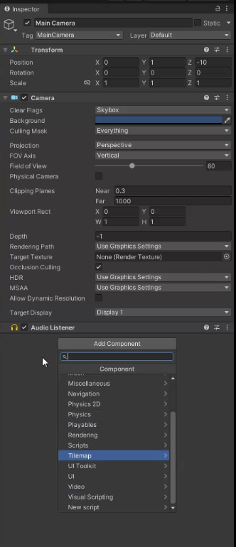

### 리얼타임 엔진(Real Time 3D)

애니메이션, 디자인 또는 그래픽과 같은 시각화를 즉시 생성할 수 있게해주는 도구

- 제품 제작 전, 디자인 오류를 줄이기 위한 실시간 렌더링이 중요
- 몰입형 기술로 제품 디자인을 경험해보는 것이 디자인 프로세스에 중요
- 아우디 디지털 쇼룸
- **렌더링 타임 적게 소요**

| 언리얼                                  | 유니티 (60%이상)                                     |
| --------------------------------------- | ---------------------------------------------------- |
| Unreal은 실감있는 RT3D 개발 환경을 제공 | 전세계에서 가장 널리, 많이 사용되는 RT3D 개발 플랫폼 |
| C++, blueprint                          | C#                                                   |
| 퀄리티가 높다.                          | 무료 asset이 많다.                                   |

### setting

[Unity Store - 다운로드](https://store.unity.com/kr/download)
유니티 허브 다운로드 -> exe 파일 설치

 Game: 사용자 시선 

 component

project view에 있다고해서 프젝 안에 마리오가 들어가는게 아님, hierarchy에 넣어야함.