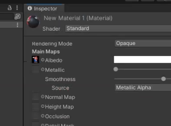 

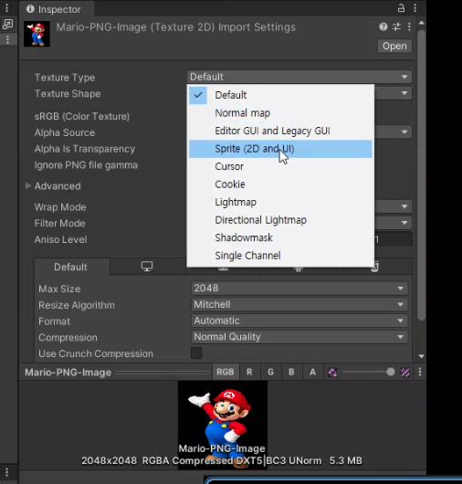 

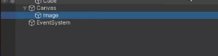 

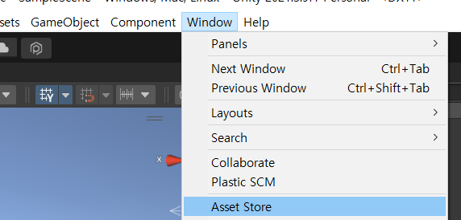 

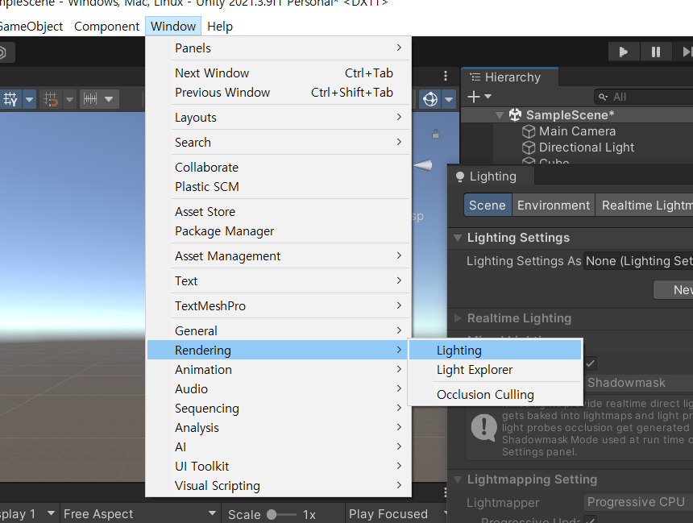 

360 camera

360 image

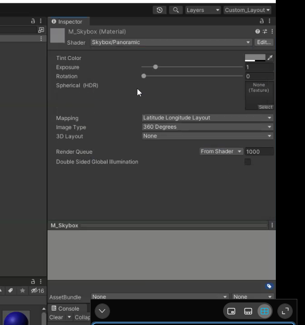 

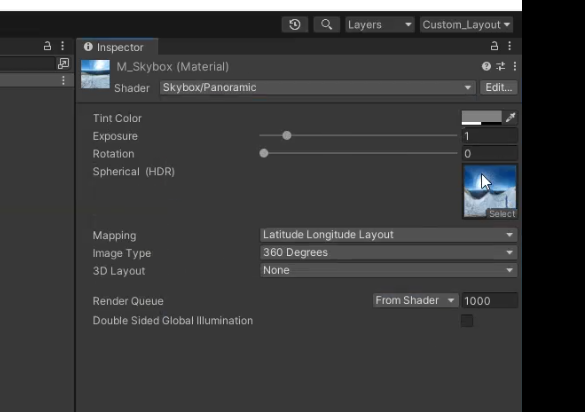 

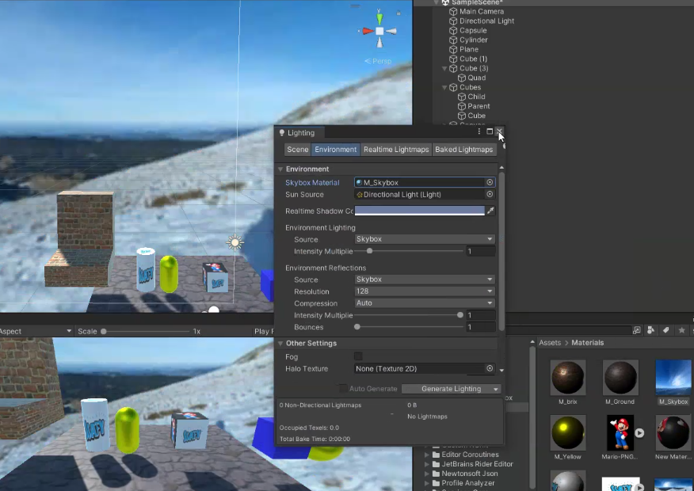 

c#script는 바로 해줘야함

에딧-프리퍼런스-

unity manual

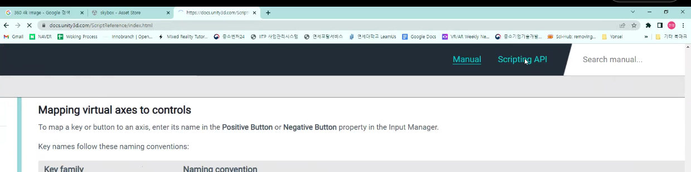

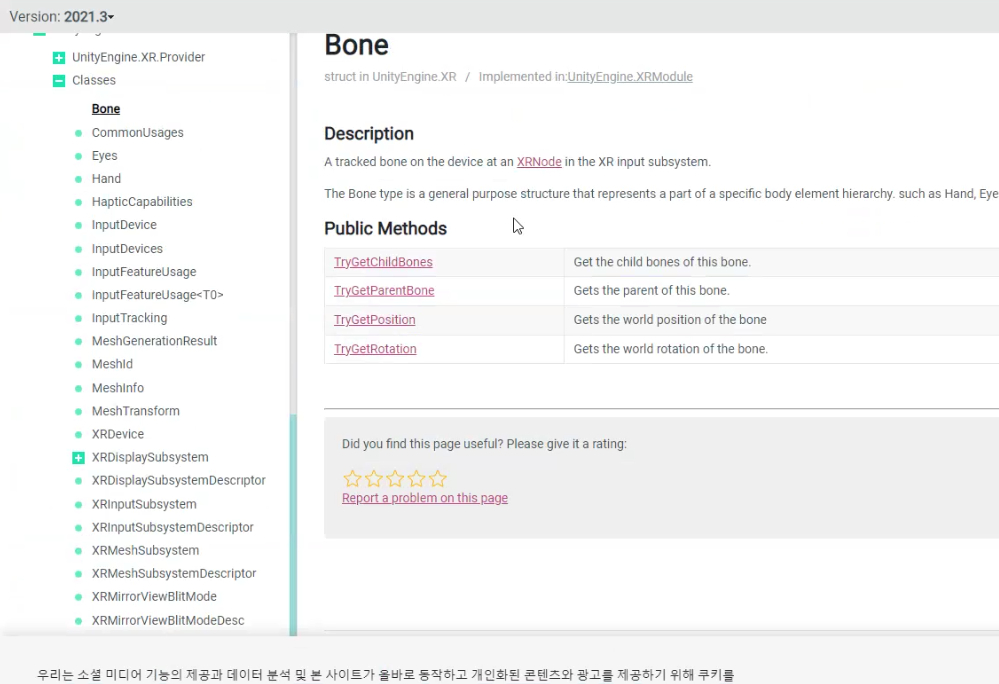 

Project view랑 hierachy는 별개임

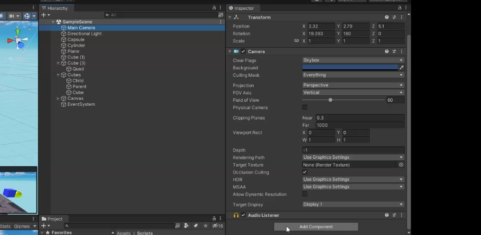 

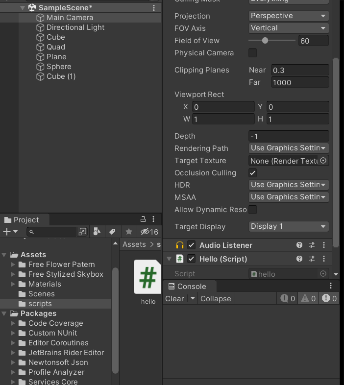 

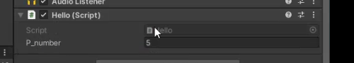 

public으로 선언하면 유니티 엔진 상에서도 접근 및 변경할 수 있음.

유니티에서도 중력을 적용해서 걸어다니게 할 수 있다.

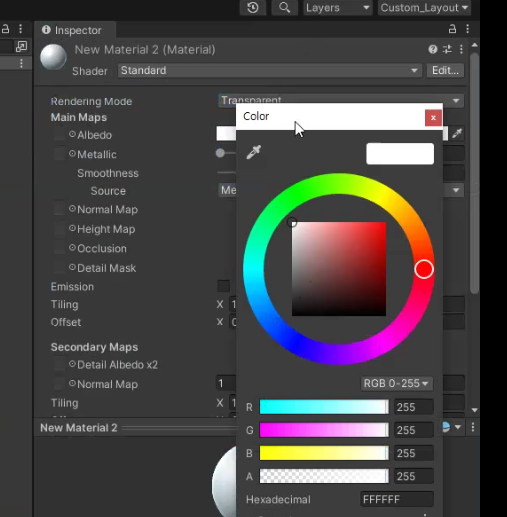 

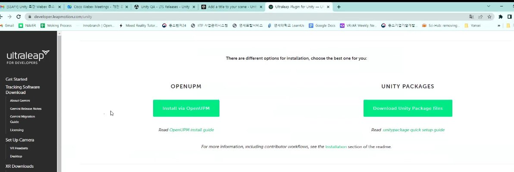 

외부 3d툴에서 유니티로 임포트 하는 법

- Drag & Drop
- 혹은 import package
- import 하면 여기 들어옴

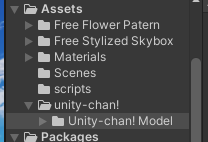 

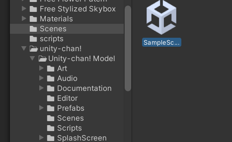 

- scene에 next누르면서 모션 확인 가능
- import한 에셋에서 Prefabs = 재사용 가능한 에셋 (계속 쓸 것 같은 에셋은 prefab으로 만들어줌)

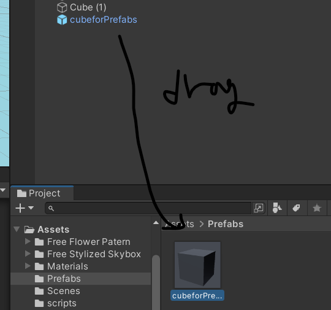 

더블클릭 후 요소 적용

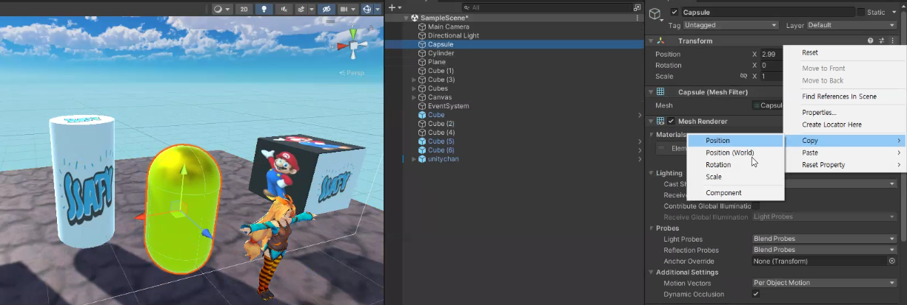 

다른 포지션 복붙하면 캡슐 안으로 들어갈 수 있음,  mesh~~ 지우면 뭔가 사라짐

- script api location의 정보를 변경 할 수 있다.

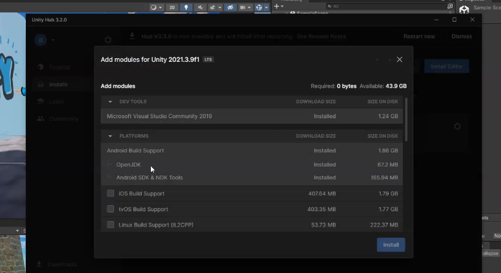 

톱니바퀴 add module

모두 체크표시 한 후  sdk설정하기