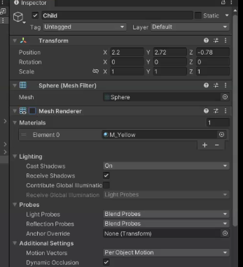
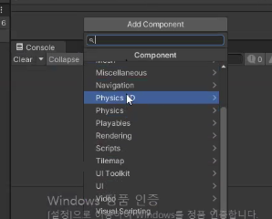
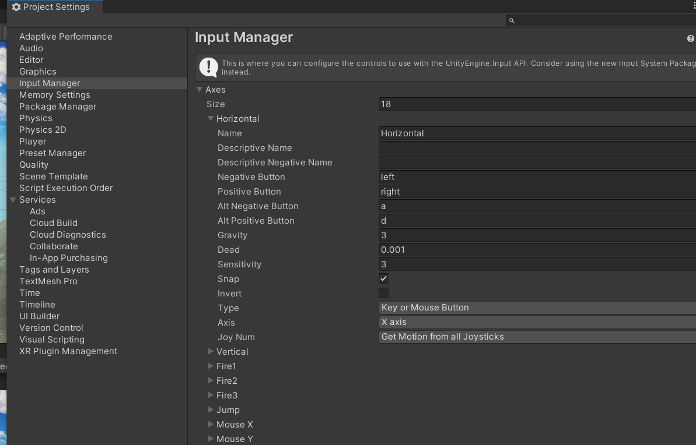
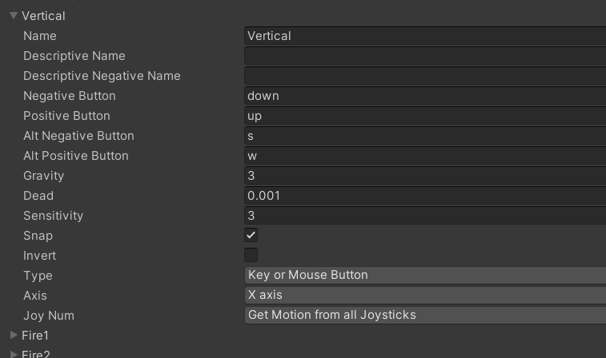
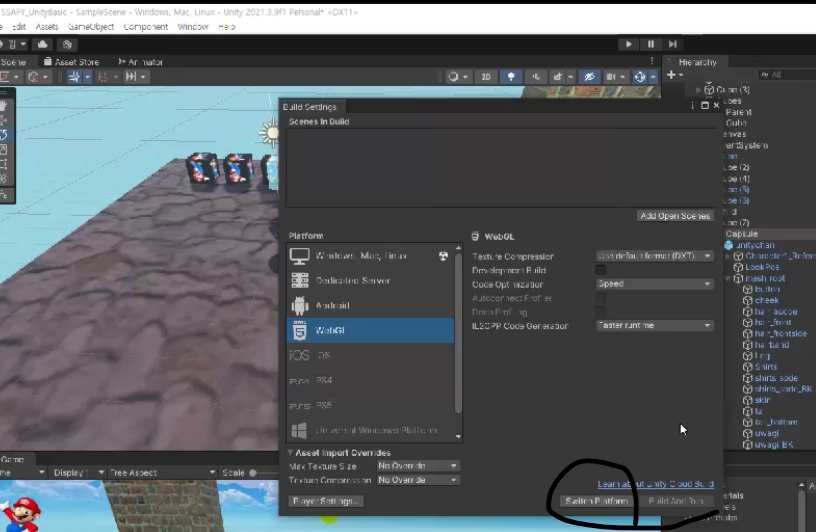

# :star: 물리엔진

 

meshRender 끄기, 밑의 colider는 켜두기

콜라이더가 있기 떄문에 공이 부딪힐 수 있는 것인데, 플레이를 해도 공이 움직이지를 않음

 

add component의 physics->rigidbody

mass: 질량

drag: 공기저항(낙하산 같은거 천천히 떨어짐)

useGravity: 중력 사용할 것인지? (play하면 떨어짐, 충돌하면 굴러감ㅋㅋ)

### test

cube -> script -> create->c#script 이름짓기

edit -> projectsettings -> input manager -> axes

 

 

edit->preference 자동완성

script만들어서 add component (재생 후 추가)

 

switch platform 하면 webgl로 빌드 가능

boxcolider의 edit colider로 편집해서, 근처에 접근했을때 인지하게 

1unit = 1m

scale은 *10해야하므로 1scal 은 10m

머터리얼의 타일링을 통해 촘촘한 땅 표현 가능

윈도우, 렌더링, 라이팅, 스카이박스 change