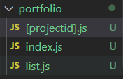
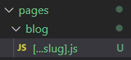
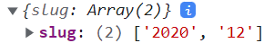
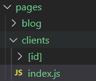

# Routing

[TOC]


- index.js 하위에 자바스크립트 파일로 만들어 라우팅
- 폴더로 명시해 라우팅

```js
/pages
- index.js -> Main start page (special file name)
- abount.js -> abount page //(domain.com/about)
- /products
    - index.js-> all products page //(domain.com/products)
    - [id].js -> product detail page //(domain.com/products/1) (dynamic-동적)
```

### 단일 세그먼트 값으로 동적 라우팅

  이런 폴더구조에서 만일 portfolio/1234/list로 이동하려고 하면 listpage나옴

-> next.js 는 동적 페이지 파일보다, 정적 페이지파일을 우선시함

```js
import { useRouter } from "next/router";
function PortfolioProjectPage() {
  const router = useRouter();
  console.log(router.pathname);
  console.log(router.query);
```

### 모든 라우트를 한번에 catch 하는 법

`http://localhost:3000/blog/2020/12`

 

- ...으로 해당하는 모든 url을 렌더링함

### Link component로 navigating

`a tag를 사용하여 렌더할 경우, 새 http 요청을 보내 변경될 수 있음
앱에 머무르며 app-wide state를 유지할 것`

-> back에서 http 요청을 새로 보낼 필요도, app 상태가 바뀌지도 않기 위해 Link 사용

**href 대신 replace property를 설정하면, 새로운 페이지를 또 띄우지 않고 현재 페이지를 새 페이지로 바꿀 수 있음 (뒤로가기 불가)** 

```jsx
import Link from "next/link";

function HomePage() {
  return (
    <div>
          <Link href="/portfolio">PortFolio</Link>
    </div>
  );
}

export default HomePage;
```

 

```jsx
import Link from "next/link";
function ClientPage() {
  const clients = [
    { id: "max", name: "maxmilian" },
    { id: "manu", name: "manuel" },
  ];
  return (
    <div>
      <h1>The ClientPage</h1>
      <ul>
        <li><Link href="/clients/max">Maximilian</Link></li>
        <li><Link href="/clients/manu">Manuel</Link></li>
      </ul>
      <ul>
        {clients.map((client) => (
          <li key={client.id}>
            <Link href={`clients/${client.id}`}>{client.name}</Link>
            <Link
              href={{
                pathname: "/clients/[id]",
                //id에 들어갈 구체적인 값
                //userouter그 자체
                query: { id: client.id },
              }}
            >
              {client.name}
            </Link>
          </li>
              
        ))}
      </ul>
    </div>
  );
}
export default ClientPage;

```

- 버튼으로 라우트하기 (form을 제출한 경우)

```jsx
import { useRouter } from "next/router";
function ClientProjectPage() {
  const router = useRouter();
  function loadProjectHandler() {
    router.push("/clients/max/projecta");
    router.push({
      pathname: "clients/[id]/[clientprojectid]",
      query: { id: "max", clientprojectid: "projecta" },
    });
  }
  return (
    <div>
      <h1>The Projects of a Given Client</h1>
      <button onClick={loadProjectHandler}>Load Project A</button>
    </div>
  );
}

export default ClientProjectPage;
```

### 404.js

- pages/404.js

### 모듈 요약

- next.js
  - filebase routing
  - No extra boilerplate code required
  - Intutive system
  - file + folder structure infulences routes
  - navigate works with <Link> component and imperatively
- react + react-router
  - codebase routing
  - Boilerplate setup in code required <switch>, <Route>...
  - straightforward but includes new compontns + concepts
  - file + folder setup does not matter at all
  - navigate works with <Link> component and imperatively