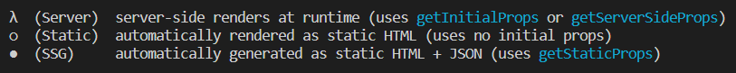

[TOC]

# Render

- **정적 생성 (Static Generation)**
  - **pre-generate** a page during build time -> pages are prepared ahead to time and can be cached by the server / CDN serving the app

## getStaticProps(context)

- 애플리케이션을 제공하는 실제 서버에서 실행되지 않고,` 페이지가 빌드될 때 실행`됨

- 클라이언트 사이드 시 실행되는거 X 

- page folder의 components에 `getStaticProps` 정의

  - getStaticProps: 특수한 비동기 함수
  - 클라이언트, 서버사이드 등 모두에 사용 가능
  - `사전에 페이지를 렌더링 할 수 있도록 도와주는 함수`

  ```jsx
  export async function getStaticProps(context){...}
  ```

  ```jsx
  // index.js
  import fs from "fs";
  import path from "path";
  
  export default function HomePage(props) {
    const { products } = props;
    return (
      <ul>
        {products.map((product) => (
          <li key={product.id}>{product.title}</li>
        ))}
      </ul>
    );
  }
  
  export async function getStaticProps() {
    // * 모든 파일이 루트 프로젝트 폴더에 적용
    const filePath = path.join(process.cwd(), "data", "dummy-backend.json");
    const jsonData = await fs.readFileSync(filePath); // * 파일을 동기적으로 읽고 완료될때까지 실행을 차단함
    const data = JSON.parse(jsonData);
    /* 
    @ 먼저 실행 후 컴포넌트 실행됨
    @ 언제나 object를 반환하며 키를 가짐(ex: props, products..)
    @ csr시 실행되지 않음 -> credential code 
    */
    if (!data) {
      return {
        redirect: {
          //데이터패칭에 실패한경우
          destination: "/no-data",
        },
      };
    }
    if (data.products.length === 0) {
      return { notFound: true };
    }
    return {
      props: {
        // products: [{ id: "p1", title: "product 1" }],
        products: data.products,
      },
      // ISR(Incremental Static Generation)을 위함
      //!next.js가 이 페이지를 재생성할때까지 기다려야 하는 시간을 초단위로 입력
      revalidate: 10, //!10초 (600-10분) // 유효성 재검사 (오래된데이터 교체)
    };
  }
  ```
  
  - build시, getStaticProps로 인해, 미리 페이지가 만들어짐
  
   
  
  O: 사전생성
  
  ●: 정적 생성
  
  - 단점: 자주 바뀌는 데이터라면?
  
    - 서버에서 업데이트된 데이터를 useEffect로 fetching해주기
  
    -  ISR(Incremental Static Generation)
  
      - next build로 프로젝트를 빌드한다. ISR은 Next의 내장 기능으로 페이지 빌드시, 정적으로 한번 생성에 더해 + 재 배포없이 계속 업데이트 된다.
  
        ```
        pre-generate page
        - Re-generate it on every request, at most every X seconds
        	- serve 'old' page if re-generate is not needed yet
        	- generate, store and serve 'new' page otherwise
        ```
  
      - 페이지가 재생성(새로고침) 될 때마다, 혹은 `배포된 후의 서버`에서 `revalidate`설정한 것이 실행됨
      - 10초로 설정시, 10초가 되지 않았을때 새로고침하는건 영향이 가지 않음

    - npm run build 후 npm start로 시작하면 터미널에 서버사이드에 관한게 표시됨
  
- context vs useRouter (컴포넌트 함수와 getstaticProps()에서 매개변수를 추출할때의 차이)

  - 컴: 컴 내부에서 사용가능, 추출된 ID 사용 혹은 백에 데이터를 패칭할때 쓰임 -> 오직 브라우저에서만 이루어짐
  - getstaticprops로 데이터를 준비해 페이지 사전렌더링시, 서버에서 이루어짐
    - getstaticprops는 컴포넌트 함수보다 `먼저` 실행됨
    - 서버상에서 getstaticprops로 구축하려면
    - getstaticprops 내부의 동적경로 부분에 접근
    -  매개변수로 컴포넌트에 대한 데이터를 준비해야함
    -  
    -  nextJs가 모든 페이지를 사전생성하나 `동적페이지`에선 그러지 않음 
    - 대괄호로 시작하는 파일명 -> 여러 페이지로 이루어지기 때문에 서버에서 그때그때 생성되는데 getStaticProps를 써서 동작하지 않음
    - 비동기 처리를 지원함: `getStaticPaths(){...}` page component에만 추가할 수 있음

## getStaticPaths

- getStaticProps를 사용할때, 어떤 동적페이지의 인스턴스를 사전 생성할지 알려주는 함수
- paths라는 키를 가지며, 매개변수 객체 배열을 보유함

```jsx
// pages/[pid].js
import fs from "fs";
import path from "path";

const ProductDetailPage = (props) => {
  const { loadedProduct } = props;

  return (
    <>
      <h1>{loadedProduct.title}</h1>
      <p>{loadedProduct.description}</p>
    </>
  );
};

export async function getStaticProps(context) {
  //context변수를 통해 구체적인 url경로 값을 알 수 있음
  const { params } = context;
  const productId = params.pid; // userouter를 통해 얻을 수도 있다.

  const filePath = path.join(process.cwd(), "data", "dummy-backend.json");
  const jsonData = await fs.readFileSync(filePath);
  const data = JSON.parse(jsonData);

  // Id에 맞는 데이터 사전준비
  const product = data.products.find((product) => product.id === productId);

  return {
    props: {
      loadedProduct: product,
    },
  };
}

export async function getStaticPaths() {
  // @ paths 키가 있는 객체여야함
  return {
    paths: [
      //객체를 가진 배열
      //이 페이지로 연결하는 각각의 동적 세그먼트 식별자
      { params: { pid: "p1" } },
      { params: { pid: "p2" } },
      { params: { pid: "p3" } },
    ],
    fallback: false, // 타 routes는 404
  };
}

export default ProductDetailPage;

```

```jsx
// pages/[pid].js.......

const ProductDetailPage = (props) => {
  const { loadedProduct } = props;

  // *fallback설정
  if (!loadedProduct) {
    return <p>Loading...</p>;
  }

  return (
    <>
      <h1>{loadedProduct.title}</h1>
      <p>{loadedProduct.description}</p>
    </>
  );
};

///.......

export async function getStaticPaths() {
  return {
    paths: [{ params: { pid: "p1" } }],
    // 사전생성 되야할 데이터가 많을때는, 시간이 오래걸리게됨 -> true: 일부 페이지만 사전 렌더링
    // pid 매개변수에 대한 값이 없더라도(ex/ p3), 페이지 방문시 로딩할수 있도록 함.
    // 사전생성방식이 아닌, 요청이 서버에 도달했을시 생성됨
    fallback: true,
    // fallback: 'blocking'으로 설정할 경우, 컴포넌트에서 fallback설정을 할 필요 X//로딩시간이 긴것 처럼 보일뿐
  };
}

export default ProductDetailPage;

```

```jsx
import fs from "fs";
import path from "path";

const ProductDetailPage = (props) => {
  const { loadedProduct } = props;

  return (
    <>
      <h1>{loadedProduct.title}</h1>
      <p>{loadedProduct.description}</p>
    </>
  );
};

async function getData() {
  const filePath = path.join(process.cwd(), "data", "dummy-backend.json");
  const jsonData = await fs.readFileSync(filePath);
  const data = JSON.parse(jsonData);

  return data;
}

export async function getStaticProps(context) {
  //context변수를 통해 구체적인 url경로 값을 알 수 있음
  const { params } = context;
  const productId = params.pid; // userouter를 통해 얻을 수도 있다.

  const data = await getData();
  // Id에 맞는 데이터 사전준비
  const product = data.products.find((product) => product.id === productId);

  return {
    props: {
      loadedProduct: product,
    },
  };
}

export async function getStaticPaths() {
  const data = await getData();
  const ids = data.products.map((product) => product.id);
  const pathsWithParams = ids.map((id) => ({ params: { pid: id } }));
  return {
    paths: pathsWithParams,
    fallback: "blocking",
  };
}

export default ProductDetailPage;
```

```jsx
// pages/[pid].js
import fs from "fs";
import path from "path";
import { Fragment } from "react";

const ProductDetailPage = (props) => {
  const { loadedProduct } = props;

  // *fallback설정
  if (!loadedProduct) {
    return <p>Loading...</p>;
  }

  return (
    <Fragment>
      <h1>{loadedProduct.title}</h1>
      <p>{loadedProduct.description}</p>
    </Fragment>
  );
};

async function getData() {
  const filePath = path.join(process.cwd(), "data", "dummy-backend.json");
  const jsonData = await fs.readFileSync(filePath);
  const data = JSON.parse(jsonData);

  return data;
}

export async function getStaticProps(context) {
  //context변수를 통해 구체적인 url경로 값을 알 수 있음
  const { params } = context;
  const productId = params.pid; // userouter를 통해 얻을 수도 있다.

  const data = await getData();
  // Id에 맞는 데이터 사전준비
  const product = data.products.find((product) => product.id === productId);

  // *없는 상품을 불러오려고 할때
  if (!product) {
    return { notFound: true };
  }

  return {
    props: {
      loadedProduct: product,
    },
  };
}

export async function getStaticPaths() {
  const data = await getData();

  const ids = data.products.map((product) => product.id);
  const pathsWithParams = ids.map((id) => ({ params: { pid: id } }));

  return {
    paths: pathsWithParams,
    fallback: true,
  };
}

export default ProductDetailPage;
```

- getstaticprops는 서버에 도달하는 실제 요청에 접근할 수 없음

  -> SSR이 필요하게됨 -> getServerSideProps 사용

  ex) 쿠키를 추출해야하는 경우 등

- getStaticProps vs getServerSideProps 중 하나만 사용, 충돌일으킴
- **서버사이드 렌더링**

## gerServerSideProps()

- [node관련문서1](# https://nodejs.org/api/http.html#http_class_http_serverresponse)
- [node관련문서2](# https://nodejs.org/api/http.html#http_class_http_incomingmessage)

- 서버에서만 작동하므로, next.js에서는 사전생성할 대상이 없으니 getStaticPaths정보가 필요하지 않음
- 이 경우 서버사이드코드에서 모든 요청을 처리하므로 사전생성할 필요도 없고, 동적경로 또한 미리 설정할 필요가 없음

```jsx
// user-profile.js
// !어떤 사용자가 렌더링하는지 파악해야하기때문에, 사전렌더링 할 수 없음
// !프로젝트 생성 전이 아닌, 요청이 들어올때마다 불러오는 방식
const UserProfilePage = (props) => {
  return (
    <>
      <h1>{props.username}</h1>
    </>
  );
};

export default UserProfilePage;

// ! only 배포, 개발된 서버에서만 실행됨
export async function getServerSideProps(context) {
  // params에 더해 req, res에도 접근 가능
  const { params, req, res } = context;
  console.log("Server Side Code");

  // console.log(req);
  // console.log(res);

  return {
    props: {
      username: "Max",
    },
  };
}
```

- npm run build, npm start -> getServerSideProps 있는 페이지 접근시, 데이터 Fetching

```jsx
// [uid].js
import React from "react";

const UserIdPage = (props) => {
  return <div>{props.id}</div>;
};

export default UserIdPage;

export async function getServerSideProps(context) {
  const { params } = context;
  const userId = params.uid;
  return {
    props: {
      id: "userid-" + userId,
    },
  };
}
```

# Fetching

## clientSide Data Fetching

- 갱신 주기가 잦은 데이터 - 주식 데이터 등

- 사이트에 방문했을때 백그라운드에서만 업데이트하면 좋음

- 특정 유저에 한정되는 데이터 (주문내역)

  - 다양한 데이터를 한번에 불러오면, 서버에서 대시보드 요청 처리하는데 시간이 많이 소요됨

- 사전 렌더링 보다 주어진 리액트앱에 포함된 데이터를 api에서 사용자가 페이지에 방문할때만 불러오도록 함 (useEffect, Fetch 사용)

   

   

  ```jsx
  // last-sales.js
  import { useEffect, useState } from "react";
  
  const LastSalesPage = () => {
    //서버나 개발 단계에서 데이터를 프리페칭하지 않는 경우
    // getServerSideProps를 사용하지 않으면 Next.js에서 기본 페이지를 사전 렌더링함
    const [sales, setSales] = useState();
    const [isLoading, setIsLoading] = useState(false);
  
    useEffect(() => {
      setIsLoading(true);
      fetch("https://nextjs-course-f7f75-default-rtdb.firebaseio.com/sales.json")
        .then((response) => response.json())
        .then((data) => {
          const transformedSales = [];
          for (const key in data) {
            transformedSales.push({ id: key, username: data[key].username, volume: data[key].volume });
          }
          setSales(transformedSales);
          setIsLoading(false);
        });
    }, []);
  
    if (isLoading) {
      return <p>Loading...</p>;
    }
  
    if (!sales) {
      return <p>No data yet</p>;
    }
  
    return (
      <ul>
        {sales.map((sale) => (
          <li key={sale.id}>
            {sale.username} - ${sale.volume}
          </li>
        ))}
      </ul>
    );
  };
  
  export default LastSalesPage;
  ```

# useSWR

[SWR](# https://swr.vercel.app/ko) (stale - while - revalidate)

CSR data Fetching

```
useSWR로 작업을 할 때는, 기본 “fetcher”를 추가해야 합니다.

useSWR(<request-url>, (url) => fetch(url).then(res => res.json()))
다음 강의에서 자세히 설명할 테지만, 이 훅을 사용할 때 문제가 발생한다면 위에서 언급한 부분을 변경해 주세요!
```

- npm i swr
- automatic Revalidation 등 유용한게 많음!

```jsx
// last-sales.js
import { useEffect, useState } from "react";
import useSWR from "swr";

const LastSalesPage = () => {
  const [sales, setSales] = useState();

  // ! 하나이상의 인수로서 보낼 요청의 식별자가 필요, 이 훅이 같은 url에 요청을 한번에 묶어서 보냄
  // ! 컴포넌트 로딩시, 요청감
  // const { data, error } = useSWR("https://nextjs-course-f7f75-default-rtdb.firebaseio.com/sales.json");
  const { data, error } = useSWR("https://nextjs-course-f7f75-default-rtdb.firebaseio.com/sales.json", (url) =>
    fetch(url).then((res) => res.json())
  );

  useEffect(() => {
    if (data) {
      const transformedSales = [];
      for (const key in data) {
        transformedSales.push({ id: key, username: data[key].username, volume: data[key].volume });
      }
      setSales(transformedSales);
    }
  }, [data]);


  if (error) {
    return <p>No data Yet</p>;
  }

  if (!data || !sales) {
      //return 을 쓰면 안될듯..?
     <p>Loading...</p>;
  }

  return (
    <ul>
      {sales.map((sale) => (
        <li key={sale.id}>
          {sale.username} - ${sale.volume}
        </li>
      ))}
    </ul>
  );
};

export default LastSalesPage;
```

# SSR + CSR

- revalidate할 필요 없이 useSWR로 data변경시 자동 refetching시킴
- 다만 페이지 소스를 봤을때, 변경된 데이터까지 반영되있진 않음 !

```jsx
import { useEffect, useState } from "react";
import useSWR from "swr";

const LastSalesPage = (props) => {
  const [sales, setSales] = useState(props.sales);
  // * 데이터가 변경되면 CSR에서 패칭된 이후로, 업데이트된 데이터를 볼 수 있지만 소스에선 볼 수 없음
  // * 자동으로 fetching 됨
  // * 프로덕션으로 구축 후 실행 시 유효성 재검사를 하지 않도록 revalidate를 제거하고 나면 페이지 소스에서 확인하기 쉬움

  // ! useSWR이 데이터 변경되면 자동으로 fetching해줌
  const { data, error } = useSWR("https://nextjs-course-f7f75-default-rtdb.firebaseio.com/sales.json", (url) =>
    fetch(url).then((res) => res.json())
  );

  useEffect(() => {
    if (data) {
      const transformedSales = [];
      for (const key in data) {
        transformedSales.push({ id: key, username: data[key].username, volume: data[key].volume });
      }
      setSales(transformedSales);
    }
  }, [data]);

  if (error) {
    return <p>No data Yet</p>;
  }

  // sales가 정의되지 않음
  if (!data && !sales) {
    return <p>Loading...</p>;
  }

  return (
    <ul>
      {sales.map((sale) => (
        <li key={sale.id}>
          {sale.username} - ${sale.volume}
        </li>
      ))}
    </ul>
  );
};

export async function getStaticProps() {
  // react component가 아니라서 useSWR을 사용할 수 없음
  
  // !! async await
  const response = await fetch("https://nextjs-course-f7f75-default-rtdb.firebaseio.com/sales.json");
  const data = await response.json();

  const transformedSales = [];
  for (const key in data) {
    transformedSales.push({ id: key, username: data[key].username, volume: data[key].volume });
  }
  return {
    props: {
      sales: transformedSales,
    },
    // revalidate: 10,
  };

  // !! fetch then
  // return fetch("https://nextjs-course-f7f75-default-rtdb.firebaseio.com/sales.json")
  //   .then((response) => response.json())
  //   .then((data) => {
  //     const transformedSales = [];
  //     for (const key in data) {
  //       transformedSales.push({ id: key, username: data[key].username, volume: data[key].volume });
  //     }
  //     return {
  //       props: {
  //         sales: transformedSales,
  //       },
  //       revalidate: 10,
  //     };
  //   });
}

export default LastSalesPage;
```
