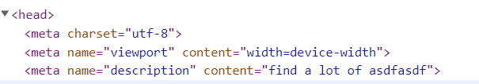

[TOC]

# next Js 최적화

## metadata

```jsx
import Head from "next/head";

const HomePage = () => {
  return (
    <div>
      <Head>
        <title>NextJs Events - {event.title}</title>
        <meta name="description" content="find a lot of asdfasdf" />
      </Head>
      <EventList items={featuredEvents} />
    </div>
  );
};

export default HomePage;
```

 

- content : 구글 검색엔진에서 사용됨

```jsx

  let pageHeadData = (
    <Head>
      <title>Filtered Events</title>
      <meta name="description" contents={`a list of filtered data}`} />
    </Head>
  );

  if (!loadedEvents) {
    return (
      <Fragment>
        {pageHeadData}
        <p className="center">Loading...</p>
      </Fragment>
    );
  }

  const filteredYear = filterData[0];
  const filteredMonth = filterData[1];

  const numYear = +filteredYear;
  const numMonth = +filteredMonth;

  pageHeadData = (
    <Head>
      <title>Filtered Events</title>
      <meta name="description" contents={`all events for ${numMonth} / ${numYear}`} />
    </Head>
  );

    return (
      <Fragment>
        {pageHeadData}
        <ErrorAlert>
      </Fragment>
    );
  }

```


## head tags

 

수동 키를 추가해서 두 요소가 충돌하는지 여부 살필 수 있음

-  한 컴포넌트에서 두개의 head를 쓰면 최근에 만들어진 head를 적용함
- `페이지 고유 head data`가 있으면, `_app.js`에서 적용한 head를 `오버라이드함`

## _document.js

`문서가 가지는 기본 구조`

app.js 는 애플리케이션 shell , body 속 루트 컴포넌트

documents는 html문서를 커스텀 할 수 있게해줌

- 기본 문서를 오버라이드 하는 이유 : 

```jsx
pages/_document.js
import Document, { Html, Head, Main, NextScript } from "next/document";

// next/head는 특수한 문서 컴포넌트에만 사용됨
class MyDocument extends Document {
  render() {
    return (
      <Html lang="en">
        <Head />
        {/* React의 portal과 같은 요소 */}
        <body>
          <div id="overlays" />
          <Main />
          <NextScript />
        </body>
      </Html>
    );
  }
}

export default MyDocument;
```


## re-using components, loging

## optimizing img

`import Image from 'next/image'`

`.next/cache/image`

- 크롬에 최적화된 이미지 타입인 webp로 변경되며 Mb -> Kb로 이미지를 줄여줌

- 기본이미지가 lazy loading됨
- 필요할때만 로딩함
- width와 height은 접속한 사용자 화면에서 fetch해오는 크기일 뿐, css속성을 상위에 적용가능함

- https://fe-developers.kakaoent.com/2022/220714-next-image/