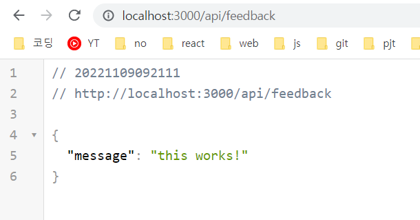

[TOC]

# API ROUTE

```python
API: application Programing Interface
# api route: 특수한 형태의 route, Next.js app 내에서 api 앤드포인트를 정의하게 해줌
REST API같은 api를 NEXT JS에 구축하여 사용
Javascript Code인 ajax 요청으로 trigger된다.
```


## pages/api

`node.js`

- Get요청만을 처리할 수 없으며, HTML코드를 반환하지 않아도 됨
- 서버사이드 코드를 실행할 수 있다.
- 여기 작성된 코드는 웹페이지 방문사람들에겐 보이지 않음

```jsx
function handler(req, res){
    res.status(200).json({message: 'this works!'}); // 받은 요청에 포함된 데이터를 JSON형식으로
}
export default handler
```

 

- 그냥 form에서 데이터베이스로 접근하는건 보안 상 db가 노출되기 때문에 취약핟.
- api routes에서 db에 접근 -> 안전