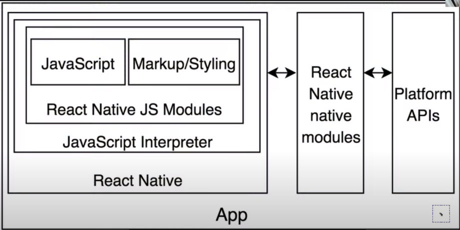
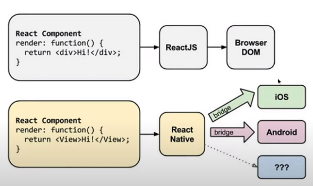
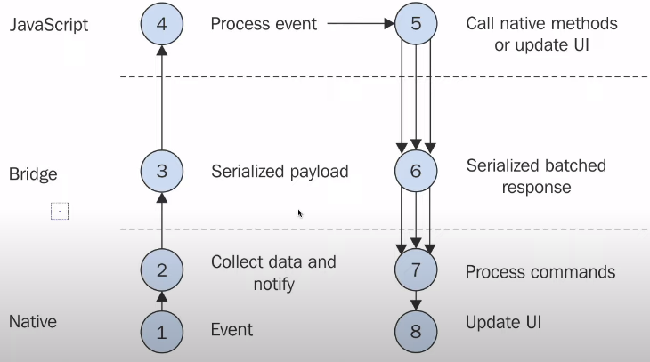

## Requirements 

`java, xcode`

 

## EXPO

**JS, MarkUp/styling부분을 제외하고 모든게 설치된 툴**
https://expo.dev/

```bash
npm i --global expo-cli
expo init NomadWeather
expo login
```

expo app 설치

 

### Bridge

`RN == Interface
RN requests IOS, Android to display buttons.
-> button shape mismatch`

 

`android=java, ios=object-c&swift`

### Online CodeEditor with ReactApplication

https://snack.expo.dev/?