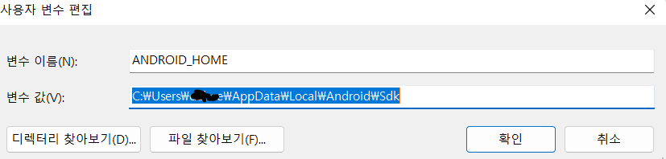
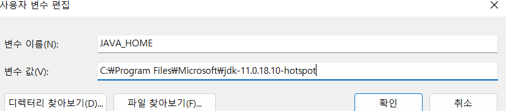

# Requirements

choco install -y nodejs-lts microsoft-openjdk11

Android studio 설치 후, Android SDK (30API LEVEL) 설치

platform-tools안에 adb꼭

C:\Users\사용자\AppData\Local\Android\Sdk\platform-tools





path에

C:\Users\본인계정명\AppData\Local\Android\sdk\platform-tools 추가로 등록하기! =\_=

```cmd
where javac
C:\Program Files\Microsoft\jdk-11.0.18.10-hotspot

bin앞까지만 사용
```

```cmd
전역으로 설치
npm i -g react-native

npx react-native init FoodDeliveryApp --template react-native-template-typescript

npm run android
//or npm start // metroserver start
```

# Structure

webpack이 아닌 metro-dev server가 있음

StyleSheet.create가 성능적으로 좋음 -> RN이 ID부여해줌

변수 들어갈떄만 inline-style

dp단위, 화면배율이나 퍼센트랑은 다름 (해상도에 따름)

SafeAreaView로 노치부분 안채워지도록함.

react-native-status-bar-height 라이브러리로 기계 높이 구할 수 있음.

ScrollView, FlatList로 스크롤할 수 있음 (컨텐츠 많을시 FlatList)

`react-native-rename/blob/master/src`

webView -> 실시간으로 고칠 수 있어서 사용

## Fliiper
