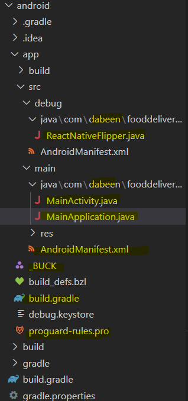

# Requirements

choco install -y nodejs-lts microsoft-openjdk11

Android studio 설치 후, Android SDK (30API LEVEL) 설치

platform-tools안에 adb꼭

C:\Users\사용자\AppData\Local\Android\Sdk\platform-tools


path에

C:\Users\본인계정명\AppData\Local\Android\sdk\platform-tools 추가로 등록하기! =\_=

```cmd
where javac
C:\Program Files\Microsoft\jdk-11.0.18.10-hotspot

bin앞까지만 사용
```

```cmd
전역으로 설치
npm i -g react-native

npx react-native init FoodDeliveryApp --template react-native-template-typescript

npm run android
//or npm start // metroserver start
```

# Structure

webpack이 아닌 metro-dev server가 있음

StyleSheet.create가 성능적으로 좋음 -> RN이 ID부여해줌

변수 들어갈떄만 inline-style

dp단위, 화면배율이나 퍼센트랑은 다름 (해상도에 따름)

SafeAreaView로 노치부분 안채워지도록함.

react-native-status-bar-height 라이브러리로 기계 높이 구할 수 있음.

ScrollView, FlatList로 스크롤할 수 있음 (컨텐츠 많을시 FlatList)

`react-native-rename/blob/master/src`

webView -> 실시간으로 고칠 수 있어서 사용

## Fliiper

```js
npm start --reset-cache
android 폴더 안에서
./gradlew clean
```

## Tips

pressable로 스타일 따로주기< touchablehighlight보다 권장


## React-navigation

[링크](#https://reactnavigation.org/docs/getting-started/)

react-navigation vs react-router-native

react-navigation - 앱에서 자주쓰이는 네비게이션 모아둠

-> navigation.push('home') : 이전 페이지의 상태가 남아있게 됨

Pressable, TouchableWithoutFeeedBack -> ios, android 차이 없음

## Bottom-tabs

페이지와 관련한 타입을 페이지 안에 작성

## 앱 이름 변경 시

react-native-nmap 사용시

com.dabeen.fooddeliveryapp으로 변경


cd android
gradlew.bat
gradlew clean
react-native start --reset-cache

## 권한 얻기

npm i react-native-permission

permissions flow 읽어보기

`denied뜨면 메시지 띄어주기(request)`, block 등일땐 수동으로 권한 띄워달라고 해야함.

## 이미지 용량 관련

npm i react-native-image-crop-picker

- 사진이 갤러리에 자동으로 저장되지 않음.

npm i react-native-image-resizer

frontend단에서 image resizing해서 서버에 저장할 수 있도록 하기 (웹에선 캔버스로 리사이징)

- 이유: 서버에 이미지 저장시간이 오래걸림, 서버 용량

## 네이티브모듈 수정시

```
# fork 해서 사용
# package.json
"react-native-nmap": "https://github.com/elqla_/react-native-nmap"
```

요즘은 `npm i patch-package` 많이 사용

```
# package.json

"scripts": {
    "postinstall": "patch-package",
}

npm i

npx patch-package react-native-image-crop-picker
```

`npm i -g rimraf`
`rimraf node_modules` => 폴더 빠르게 지울 수 있음.

- module: 실제 비즈니스 로직 들어감.
  src/main/java/com/reactnative/ivpusic/imagepicker/PickerModule.java
  src/main/java/com/reactnative/ivpusic/imagepicker/PickerPackage.java
  Package -> Module 찾아서 들어가기
  ctrl + F `react`

## react-native-splash-screen

- 앱 초기 실행화면 가려줌

## react-native-fast-image

- 리액트네이티브에서 이미지를 빠르게 패칭해줌

## android-studio - logcat

- debugging

- native단 오류

## sentry 적용

- 실제 배포 후, android, ios등 어떤 기계마다 에러가 나는지 알 수 있음.

https://docs.sentry.io/platforms/react-native/

## 버전 업그레이드

https://react-native-community.github.io/upgrade-helper/

- rc 버전으로 업데이트 XX

- 최신버전: 라이브러리가 못따라감

https://medium.com/coox-tech/deep-dive-into-react-natives-new-architecture-fb67ae615ccd

- react native 최근 동향: 성능개선

## push 알림 보내기

```bash
npm i @react-native-firebase/analytics @react-native-firebase/app @react-native-firebase/messaging
npm i react-native-push-notification @react-native-community/push-notification-ios
# push 알림 firebase
# react-native-push-notification (ios는 apple push notification..) -> firebase 쓰는건 같음 (ios npx pod-install)
npm i -D @types/react-native-push-notification
```

- sentry + firebase analytics 써보기

- firebase -> project생성 후, 프로젝트 설정 -> 서비스계정 -> 새로운 비공개 키 생성

이미 실행되는 서버 끔

- taskkill /f /pid PIDNAME

### react-native-push-notification

push 알림 두가지 종류 있음

1. remote

- 서버에서 앱으로 push알림 보내는 것

2. local

- 앱 자체에서 정해진 시간에 notification을 함.
- 특정시간에 알림설정하는 것

## 기계 연결

```bash

adb devices
adb -s 기기이름 reverse tcp:8081 tcp:8081
```

cloud messaging -> 알림 보내기 test

## react-native-code-push

https://appcenter.ms/

```bash
https://appcenter.ms/users/dabeenp/apps/food-delivery-app-android/distribute/code-push/Production
appcenter login
appcenter codepush deployment list -a dabeenp/food-delivery-app-android -k

```

`strings.xml`
production: 실서비스
staging: 점검 (개발용)
npm run codepush:android

**code push 전에 항상 타겟 확인할 것**

apple에서 출시심사받을때 codepush 하면 안됨

```json
// package.json
{
  "name": "FoodDeliveryApp",
  // 1.0.11(두자리수 가능) codepush로 수정할만한 자잘한 업데이트는 마지막 (이미지, JS, font)l;
  // 1.1.0 - 코드푸쉬하지말고 스토어로 출시
  // 2.0.1 - 원래 버전과 호환 안되는 대규모 업데이트시
  "version": "1.0.0", // major, miner, patch
  "codepush:android": "appcenter codepush release-react -a dabeenp/food-delivery-app-android -d Staging --sourcemap-output --output-dir ./build -m -t 1.0", //~~3.4-버전
  "codepush:ios": "appcenter codepush release-react -a dabeenp/food-delivery-app-ios -d Staging --sourcemap-output --output-dir ./build -m -t 1.0",
  "bundle:android": "react-native bundle --assets-dest build/CodePush --bundle-output build/CodePush/index.android.bundle --dev false --entry-file index.js --platform android --sourcemap-output build/CodePush/index.android.bundle.map",
  "bundle:ios": "react-native bundle --assets-dest build/CodePush --bundle-output build/CodePush/main.jsbundle --dev false --entry-file index.js --platform ios --sourcemap-output build/CodePush/main.jsbundle.map"
}
```

환경변수 jdk\bin path에 추가

keytool -genkey -v -keystore fooddeliveryapp.keystore -alias fooddeliveryappkey -keyalg RSA -keysize 2048 -validity 10000

https://reactnative.dev/docs/0.65/signed-apk-android

```gradle
RELEASE_STORE_FILE=fooddeliveryapp.keystore
RELEASE_KEY_ALIAS=fooddeliveryappkey
RELEASE_STORE_PASSWORD=
RELEASE_KEY_PASSWORD=
```

- aab file

  - 용량 큼
  - 알아서 운영체제 맞춰짐

- apk file

  - 용량 작음
  - 여러개 파일 생성됨
  - 운영체제 맞는 사람에게 전달
    - 대부분은 v8a (옛날폰은 v7a)
