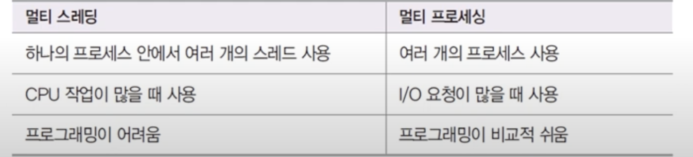

# Node

## 1. node 란?

- 크롬 v8 javascript engine으로 빌드된 js runtime.

- server역할 수행가능한 js 런타임

- node로 js로 작성된 server 실행 가능

- server실행을 위해 필요한 http/https/http2 모듈 제공

## 2. node의 특징

- 이벤트 기반

  - 콜백함수: 이벤트 발생 시 실행될 함수

- 논블로킹 I/O
  - 오래 걸리는 함수를 백그라운드로 보내 다음 코드가 실행되게 함.
  - 블로킹: 코드가 순서대로 시작되는것
- 프로세스, 스레드

  - 프로세스: 운영체제에서 할당하는 작업의 단위, 프로세스간 자원 공유 X
    (크롬 창)
  - 스레드: 프로세스 내에서 실행되는 작업의 단위, 부모 프로세스 자원 공유
    (크롬 탭)

- 노드 프로세스는 멀티 스레드지만, 직접다룰 수 있는 스레드는 하나라서 싱글 스레드라고 표현한다. (탭을 하나밖에 안쓴다고 할 수 있음)

- 멀티 스레드 대신 멀티 프로세스 활용

- 노드 14이상부터 멀티 스레드 사용 가능
  - 장점: 동시에 여러가지 일 할 수 있음.
- 32core일땐 1core만 쓰는것 - 스레드 (core)

- 싱글스레드면 에러 처리 못하고 멈춤
- cpu, memory자원 적게 사용

- 멀티스레드면 에러 발생 시 새로운 스레드 생성해 극복

-> node는 논 블로킹 모델로 일부 코드(I/O)를 백그라운드(다른 프로세스)에서 실행 가능

**멀티 스레드를 안하려고 노드를 하는 것임**

## 3. 노드의 역할

### 1) 서버로서의 노드

- 서버: 네트워크를 통해 클라이언트에 정보나 서비스를 제공하는 컴퓨터 또는 프로그램

- 클라이언트: 서버에 요청을 보내는 주체로 브라우저, 데탑프로그램, 모바일앱 등

- 노드 !== 서버

- 노드는 서버 구성할 수 있게하는 모듈제공

- js runtime이기에 서버에만 한정되지 않음

  - 웹 프레임워크: 앵귤러, 리액트 등
  - 앱: 리네
  - 데탑 개발도구: 일렉트론(atom, slack, vscode, discord)

-
