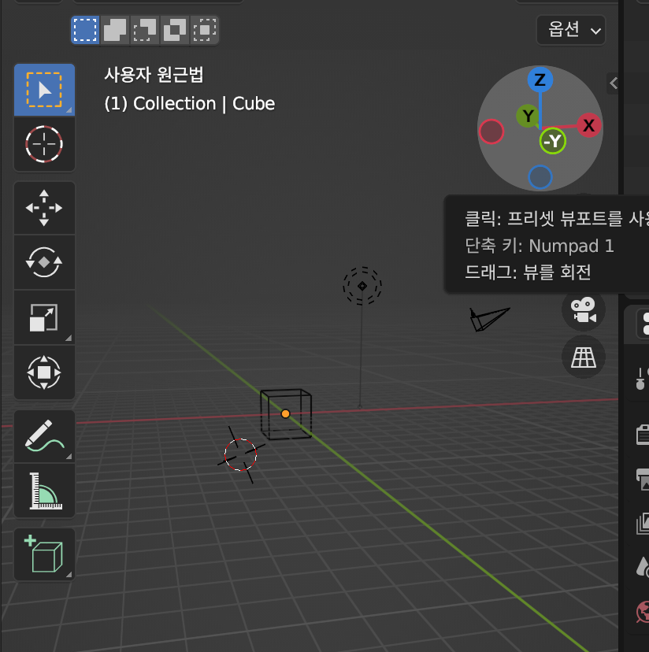

### 1. 커스텀 3d모델 포맷

- GLTF
- GLB: 블렌더

### 2. 블렌더

- https://www.blender.org/

### 3. 패널 추가/삭제

### 4. 마우스/트랙패드 컨트롤

- threejs랑 z, y가 다름

- z : 위아래
- y : 앞뒤 (정면뷰)
- x : 옆에서



### 5. 3D뷰포트 패널

- t: 왼쪽 패널
- n: 오른쪽 패널

### 6. 메쉬 크기, 추가/삭제

- 큰 눈금: 1단위
- shift + a 로 모양 추가

### 7. Object모드, Edit 모드

- aa 로 전체 선택

- tab: edit 모드

- shift 눌러서 복수 선택

- ctrl + shift + g

- shift + x

- s 로 스케일모드 + shtft+ z -> z 축 제외 스케일

- g 누른 후 x 로 빼주고 tab => 한개의 매쉬로 취급됨

```
G 키: Grab 또는 이동 도구입니다. 객체를 선택하고 G 키를 누르면 해당 객체를 움직일 수 있습니다.

S 키: Scale 또는 크기 조절 도구입니다. 객체를 선택하고 S 키를 누르면 해당 객체의 크기를 조절할 수 있습니다.

R 키: Rotate 또는 회전 도구입니다. 객체를 선택하고 R 키를 누르면 해당 객체를 회전시킬 수 있습니다.
```

### 8. 캐릭터 몸통 만들기

modifier

subdivision surface로 둥굴게

- levels viewport: 2
- refactor: 2

부드럽게하면 용량이 커짐

- tab

- ctrl + r 로 루프 잘라내기

- 모서리 선택 후 scale 조정, z 축 제외 줄이기 (shift + z)

- 몸 면 - g 키 눌러서 축방향으로 이동

### 9. 캐릭터 다리 만들기 (대칭)

면 선택해서 e 누르면 다리 나옴

미러 추가해서 다리좌아ㅏㅏㄱ

### 10. 캐릭터 팔 만들기

선택한 매쉬 위에 l 누르면 선택한 매쉬만 선택 가능..

손 선택 후 섭디비전

option + z -> 투명해짐

obj 모드로 나가서, 모디파이어 어플라이 누르기

### 11. 캐릭터 머리 만들기

쉐이드 스무드

### 12. UV 매핑 (전개도 만들기)

패널 열기, uv editor

캐릭터 옷 만들곳에 선 만든 후, all, 우측마우스, `Mark Seam` 클릭

u 클릭후 unwrap

uvmenu -> average islands scale -> pack islands

저장 후 오브젝트모드에서 ctrl p -> with automatic weight

edit 자식 > 부모 순으로 선택 ctrl p -> keep offset

r 눌러서 회전

### 13. 색칠하기

### 14. 애니메이션 뼈대 만들기

shift a + 아마츄어, 싱글본

뷰포트 표시, 앞에 표시

shift a 눌러서 뼈대 하나 추가

팔 대칭 만들때 글로벌 옆에 3d 커서로 변경

shift d 복제, s, x나 y 축방향으로 -1

다 하고

글로벌 옆에 평균포인트로 변경해주기.

### 15. 애니메이션 만들기

### 16. 파일 내보내기

### 17. 커스텀 모델 로드하기

### 18. 커스텀 모델 애니메이션

### 19. 애니메이션 과정 복습

### 20. 다운받은 파일 활용

### 21. 도미노 블럭 만들기(inset, bevel)
