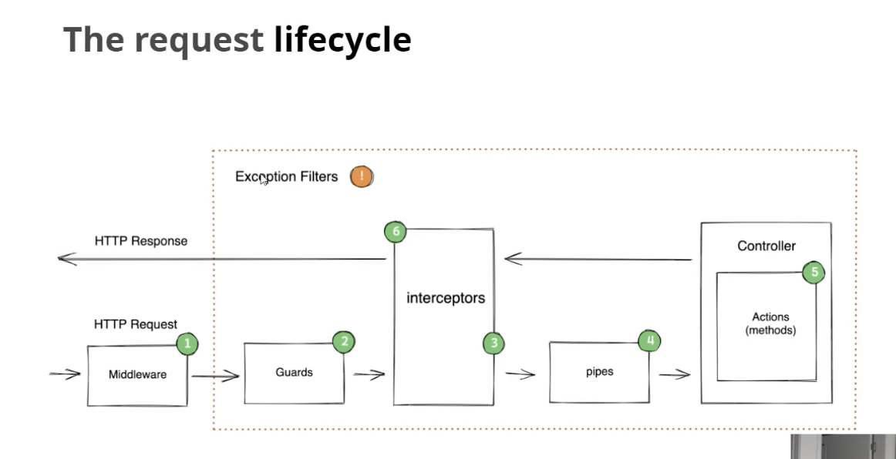

typeorm: type이 있는 orm
sql 을 생각하면서 써야한다는 점에서 시퀄라이즈보다 좋음.

sequalize-auto 가 typeorm-model-generator를 쓴다.

### DB -> Typeorm 으로 욺길때

// typeorm 0.3v이 되면서 작동하지 않는다..
npm i typeorm-model-generator -D

npx typeorm-model-generator -h localhost -d sleact -u root -x password -e mysql

output folder 의 entity를 src로 욺겨줌

npm run db:create
npm run start:dev
// synchronize: true

npm run seed

### Typeorm -> DB : synchronize: true

nest n resource users (get, post, put, delete) 다 만들어줌.

https://docs.nestjs.com/techniques/database

- npm i typeorm-extension

### Random data

seed data 주입해주기 (src/database/seeds/filename.ts)

- factory

faker library use
faker library 악성코드 있던 라이브러리이므로
@faker-js 꼭 붙이기
(typeorm-extension library 에서 보기)

### migration

- migration 할때 테이블 이름을 바꿨다던가. 했을떄 잘못 했으면 롤백하는 것도 있음

1. npm run db:create-migration
   한 후 파일 변경

또는 자동생성
npm run db:generate-migration categoryToType
엔티티 보고 바꿔줌.
"db:generate-migration": "npm run typeorm migration:generate -- ./src/migrations -d ./dataSource.ts"

2. npm run db:migrate

3. 롤백할때
   "db:migrate:revert": "npm run typeorm migration:revert -- -d ./dataSource.ts",

한번 마이그레이션한건, 다시 롤백하기전까진 migrations table에 내용이 있으므로, 롤백하기 전까진 다시 실행이 안됨.

### entities -> dto

https://docs.nestjs.com/openapi/mapped-types

### Exception

exception을 따로 다 생성해줘도 되지만,

class-validator를 통해 처리할 수도 있다.

@IsString() // validation을 하면, 알아서 에러 발생함.

https://docs.nestjs.com/techniques/validation

### Request LifeCycle

https://docs.nestjs.com/faq/request-lifecycle

